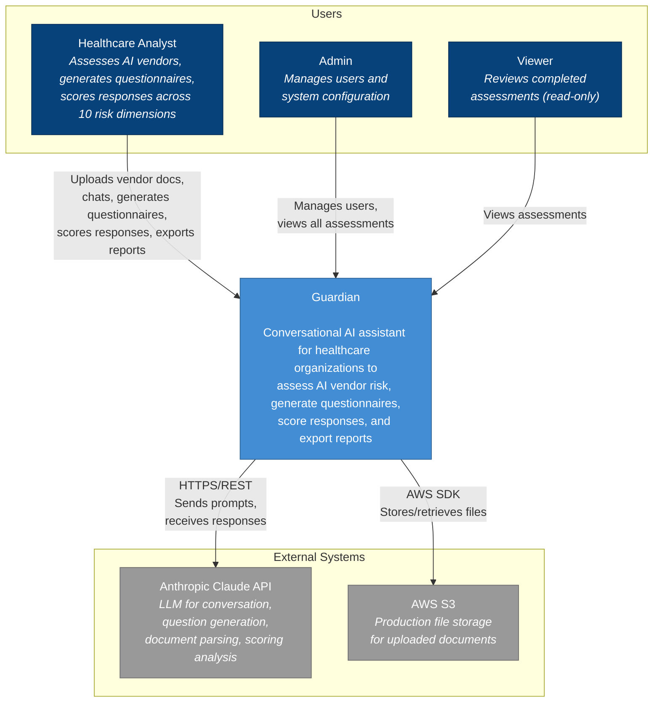
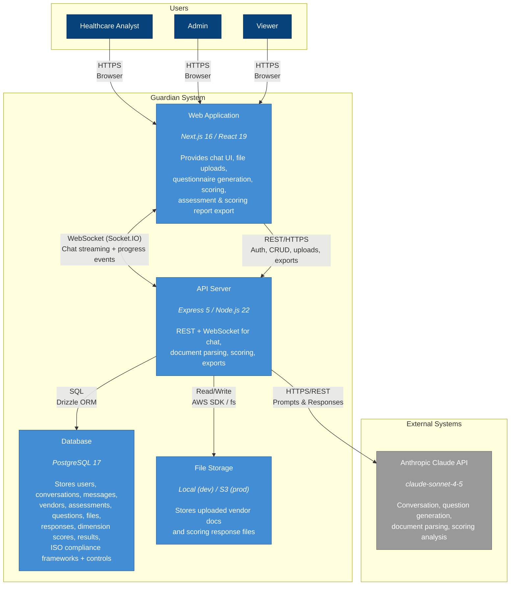

# Guardian C4 Architecture Diagrams

> **Last Updated:** 2026-02-26
> **Mermaid Version:** 11.4.1+

This document contains the C4 model diagrams for Guardian at four zoom levels.

---

## C1 - System Context

The highest level view showing Guardian as a single system with its users and external dependencies.



### C1 Summary

| Element | Type | Description |
|---------|------|-------------|
| Healthcare Analyst | User | Primary user - assesses vendors, scores responses, exports reports |
| Admin | User | Manages users, system config |
| Viewer | User | Read-only access to assessments |
| Guardian | System | Core application |
| Anthropic Claude API | External | LLM for chat, parsing, questionnaire generation, scoring |
| AWS S3 | External | Production file storage |

---

## C2 - Container Diagram

Zooms into Guardian to show the major technical building blocks.



### C2 Summary

| Container | Technology | Responsibility |
|-----------|------------|----------------|
| Web Application | Next.js 16 / React 19 | Chat UI, file uploads, questionnaire generation, scoring, export downloads |
| API Server | Express 5 / Node.js 22 | REST + WebSocket, auth, business logic, document parsing, scoring analysis |
| Database | PostgreSQL 17 + Drizzle | 16 tables: 10 core (users, conversations, messages, vendors, assessments, questions, files, responses, dimension_scores, assessment_results) + 6 ISO compliance (compliance_frameworks, framework_versions, framework_controls, interpretive_criteria, dimension_control_mappings, assessment_compliance_results) |
| File Storage | Local / AWS S3 | Uploaded intake + scoring documents |

### Protocols

| Connection | Protocol | Purpose |
|------------|----------|---------|
| Browser ↔ Web App | HTTPS | Static assets, SSR |
| Web App ↔ API | WebSocket (Socket.IO) | Real-time chat streaming, generation phases, intake/scoring progress |
| Web App ↔ API | REST/HTTPS | Auth, CRUD, file upload/download, export |
| API ↔ Database | SQL (Drizzle ORM) | Data persistence |
| API ↔ Storage | fs / AWS SDK | File operations |
| API ↔ Claude | HTTPS/REST | LLM prompts and responses |

---

## C3 - Web Application Components

Zooms into the Web Application container to show internal components.

```mermaid
flowchart TB
    subgraph webapp["Web Application (Next.js 16 / React 19)"]

        subgraph pages["Pages & Layout"]
            chatPage["ChatPage<br><i>Main chat interface route</i>"]
            authPages["Auth Pages<br><i>Login, Register</i>"]
            layout["Layout<br><i>Sidebar + main content</i>"]
        end

        subgraph components["UI Components"]
            chatInterface["ChatInterface<br><i>Orchestrates chat experience</i>"]
            composer["Composer<br><i>Message input + ModeSelector</i>"]
            messageList["MessageList<br><i>ChatMessage + QuestionnaireMessage</i>"]
            sidebar["Sidebar<br><i>ConversationList + Search</i>"]
            stepper["VerticalStepper<br><i>Generation phase progress</i>"]
            questionnaireCard["QuestionnairePromptCard<br><i>Inline questionnaire trigger</i>"]
            downloadButton["DownloadButton<br><i>Questionnaire/Scoring export</i>"]
            scoringCard["ScoringResultCard<br><i>ScoreDashboard + recommendations</i>"]
            fileChip["FileChip<br><i>Composer file preview</i>"]
            fileChipInChat["FileChipInChat<br><i>Message attachment display</i>"]
        end

        subgraph hooks["Hooks & Controllers"]
            useChatController["useChatController<br><i>Central chat orchestration</i>"]
            useWebSocketAdapter["useWebSocketAdapter<br><i>Socket.IO adapter</i>"]
            useWebSocketEvents["useWebSocketEvents<br><i>Event handlers</i>"]
            useHistoryManager["useHistoryManager<br><i>Message history</i>"]
            useConversationSync["useConversationSync<br><i>Conversation state sync</i>"]
            useConversationMode["useConversationMode<br><i>consult/assessment/scoring</i>"]
            useAuth["useAuth<br><i>JWT token management</i>"]
            useFileUpload["useFileUpload<br><i>Intake/scoring upload</i>"]
            useMultiFileUpload["useMultiFileUpload<br><i>Multi-file upload</i>"]
            useQuestionnairePersistence["useQuestionnairePersistence<br><i>localStorage cache</i>"]
        end

        subgraph state["State Management"]
            chatStore["Zustand chatStore<br><i>messages, pendingQuestionnaire,<br>generationSteps, exportReadyByConversation,<br>pendingFiles, uploadProgress,<br>scoringProgress, scoringResult</i>"]
        end

        subgraph services["Frontend Services"]
            chatService["ChatService<br><i>Send messages, abort stream</i>"]
            conversationService["ConversationService<br><i>CRUD conversations</i>"]
            wsClient["WebSocketClient<br><i>Socket.IO wrapper</i>"]
        end

    end

    subgraph external["External (API Server)"]
        restApi["REST API<br><i>/api/auth, /api/documents,<br>/api/export, /api/export/scoring</i>"]
        wsServer["WebSocket Server<br><i>/chat namespace</i>"]
    end

    %% Page to Component relationships
    chatPage --> chatInterface
    chatPage --> sidebar
    layout --> sidebar

    %% Component to Hook relationships
    chatInterface --> useChatController
    composer --> useMultiFileUpload
    composer --> useChatController
    messageList --> chatStore
    sidebar --> useChatController
    stepper --> chatStore
    questionnaireCard --> chatStore
    scoringCard --> chatStore
    fileChip --> useMultiFileUpload
    fileChipInChat --> chatStore
    downloadButton --> useAuth

    %% Hook orchestration
    useChatController --> chatService
    useChatController --> conversationService
    useChatController --> useWebSocketAdapter
    useChatController --> useWebSocketEvents
    useChatController --> useHistoryManager
    useChatController --> useConversationSync
    useChatController --> useConversationMode
    useChatController --> useQuestionnairePersistence
    useChatController --> chatStore
    useMultiFileUpload --> chatStore
    useFileUpload --> chatStore

    %% Service to WebSocket
    chatService --> useWebSocketAdapter
    conversationService --> useWebSocketAdapter
    useWebSocketAdapter --> wsClient

    %% External connections
    wsClient <-->|"Socket.IO"| wsServer
    useAuth -->|"REST/HTTPS"| restApi
    useMultiFileUpload -->|"REST/HTTPS<br>multipart/form-data"| restApi

    style chatStore fill:#F9A825,stroke:#F57F17,color:#000
    style useChatController fill:#7B1FA2,stroke:#4A148C,color:#fff
    style wsClient fill:#1976D2,stroke:#0D47A1,color:#fff
```



### C3 Web App Summary

| Layer | Components | Responsibility |
|-------|------------|----------------|
| Pages | ChatPage, AuthPages, Layout | Route entry points |
| UI Components | ChatInterface, Composer, MessageList, Sidebar, Stepper, QuestionnairePromptCard, ScoringResultCard, FileChips | Visual presentation |
| Hooks | useChatController (orchestrator), useWebSocketAdapter/useWebSocketEvents, useConversationMode, useFileUpload/useMultiFileUpload | Behavior & state logic |
| State | Zustand chatStore | Global reactive state (messages, uploads, scoring) |
| Services | ChatService, ConversationService, WebSocketClient | API communication |

### Key Patterns

- `useChatController` is the **central orchestrator** - all other hooks feed into it
- Components read from `chatStore`, hooks write to it
- `WebSocketClient` handles all real-time communication
- File uploads go directly to REST API (multipart), not WebSocket
- Scoring results persist per conversation in `chatStore` for cross-session viewing

---

## C3 - API Server Components

Zooms into the API Server container to show internal components.

```mermaid
flowchart TB
    subgraph api["API Server (Express 5 / Node.js 22)"]

        subgraph http["HTTP Layer"]
            authController["AuthController<br><i>Login, register, refresh</i>"]
            vendorController["VendorController<br><i>Vendor CRUD</i>"]
            assessmentController["AssessmentController<br><i>Assessment CRUD + status</i>"]
            questionController["QuestionController<br><i>Question CRUD</i>"]
            exportController["ExportController<br><i>Questionnaire export</i>"]
            scoringExportController["ScoringExportController<br><i>Scoring report export (PDF/Word/Excel)</i>"]
            documentController["DocumentUploadController<br><i>Upload, download, parse</i>"]
        end

        subgraph websocket["WebSocket Layer (/chat)"]
            chatServer["ChatServer<br><i>Orchestrator</i>"]

            subgraph handlers["Handlers"]
                connectionHandler["ConnectionHandler"]
                conversationHandler["ConversationHandler"]
                modeSwitchHandler["ModeSwitchHandler"]
                questionnaireHandler["QuestionnaireHandler"]
                scoringHandler["ScoringHandler"]
                scoringPostProcessor["ScoringPostProcessor<br><i>Narrative, title, export-ready</i>"]
                modeRouter["ModeRouter<br><i>Config flags per mode</i>"]
            end

            subgraph messagePipeline["Send Message Pipeline (Epic 36)"]
                sendMessageOrchestrator["SendMessageOrchestrator<br><i>7-step pipeline</i>"]
                sendMessageValidator["SendMessageValidator"]
                claudeStreamingService["ClaudeStreamingService<br><i>Streaming + abort</i>"]
                consultToolLoopService["ConsultToolLoopService<br><i>Web search loop, max 3</i>"]
                titleUpdateService["TitleUpdateService"]
                backgroundEnrichmentService["BackgroundEnrichmentService"]
            end

            subgraph contextBuilders["Context Builders"]
                convContextBuilder["ConversationContextBuilder"]
                fileContextBuilder["FileContextBuilder<br><i>buildWithImages() returns imageBlocks</i>"]
            end

            subgraph wsUtils["Utilities"]
                streamingHandler["StreamingHandler"]
                toolUseRegistry["ToolUseRegistry"]
                rateLimiter["RateLimiter"]
            end
        end

        subgraph extraction["Extraction Infrastructure (Epic 31/39)"]
            backgroundExtractor["BackgroundExtractor<br><i>Async text extraction</i>"]
            textExtractionService["TextExtractionService"]
            extractionRoutingService["ExtractionRoutingService<br><i>Regex vs Claude routing</i>"]
            regexExtractor["RegexResponseExtractor<br><i>Fast regex pipeline</i>"]
            extractionConfidence["ExtractionConfidenceCalculator"]
        end

        subgraph services["Application Services"]
            authService["AuthService<br><i>JWT auth</i>"]
            conversationService["ConversationService<br><i>Conversation lifecycle</i>"]
            assessmentService["AssessmentService<br><i>Assessment logic</i>"]
            vendorService["VendorService<br><i>Vendor management</i>"]
            questionService["QuestionService<br><i>Legacy question gen</i>"]
            questionnaireReadyService["QuestionnaireReadyService"]
            questionnaireGenService["QuestionnaireGenerationService"]
            exportService["ExportService<br><i>Questionnaire export</i>"]
            scoringService["ScoringService<br><i>Orchestrator</i>"]
            scoringLLMService["ScoringLLMService<br><i>Claude streaming + tool</i>"]
            scoringStorageService["ScoringStorageService<br><i>Persist scores</i>"]
            scoringQueryService["ScoringQueryService<br><i>Rehydration + lookups</i>"]
            scoringRetryService["ScoringRetryService<br><i>Fail-closed retry</i>"]
            scoringExportService["ScoringExportService"]
            isoRetrievalService["ISOControlRetrievalService<br><i>ISO control lookups</i>"]
            webSearchService["WebSearchToolService<br><i>Jina search + read</i>"]
        end

        subgraph domainScoring["Domain - Scoring (Epic 39/40)"]
            scoringPayloadValidator["ScoringPayloadValidator"]
            scoringPayloadReconciler["ScoringPayloadReconciler<br><i>Auto-correct arithmetic</i>"]
            subScoreValidator["SubScoreValidator"]
            compositeScoreValidator["CompositeScoreValidator"]
            subScoreRules["subScoreRules<br><i>10-dimension rules</i>"]
            rubric["rubric.ts v1.1<br><i>Weights, thresholds, disqualifiers</i>"]
        end

        subgraph domainCompliance["Domain - Compliance (ISO 27001)"]
            complianceFramework["ComplianceFramework"]
            frameworkControl["FrameworkControl"]
            interpretiveCriteria["InterpretiveCriteria"]
            dimensionControlMapping["DimensionControlMapping"]
        end

        subgraph ai["AI & Parsing"]
            claudeClient["ClaudeClient<br><i>Facade: IClaudeClient + IVisionClient + ILLMClient</i>"]
            claudeClientBase["ClaudeClientBase<br><i>Shared SDK, retry, errors</i>"]
            claudeStreamClient["ClaudeStreamClient"]
            claudeTextClient["ClaudeTextClient"]
            claudeVisionClient["ClaudeVisionClient"]
            promptCacheManager["PromptCacheManager"]
            visionContentBuilder["VisionContentBuilder"]
            documentParser["DocumentParserService"]
            scoringPromptBuilder["ScoringPromptBuilder<br><i>Rubric + ISO prompts</i>"]
            questionnaireSchema["QuestionnaireSchemaAdapter"]
            jinaClient["JinaClient<br><i>Search + Reader APIs</i>"]
        end

        subgraph data["Data Layer"]
            userRepo["UserRepository"]
            conversationRepo["ConversationRepository"]
            messageRepo["MessageRepository"]
            vendorRepo["VendorRepository"]
            assessmentRepo["AssessmentRepository"]
            questionRepo["QuestionRepository"]
            fileRepo["FileRepository"]
            responseRepo["ResponseRepository"]
            dimensionScoreRepo["DimensionScoreRepository"]
            assessmentResultRepo["AssessmentResultRepository"]
            complianceFrameworkRepo["ComplianceFrameworkRepo"]
            frameworkControlRepo["FrameworkControlRepo"]
            dimensionControlMappingRepo["DimensionControlMappingRepo"]
            interpretiveCriteriaRepo["InterpretiveCriteriaRepo"]
            jwtProvider["JWTProvider"]
        end

        subgraph exporters["Export Generators"]
            pdfExporter["PDFExporter"]
            wordExporter["WordExporter"]
            excelExporter["ExcelExporter"]
            scoringPdfExporter["ScoringPDFExporter"]
            scoringWordExporter["ScoringWordExporter"]
            scoringExcelExporter["ScoringExcelExporter"]
        end

        subgraph storage["File Storage"]
            storageFactory["createFileStorage()"]
            localStorage["LocalFileStorage<br><i>(development)</i>"]
            s3Storage["S3FileStorage<br><i>(production)</i>"]
        end

    end

    subgraph external["External Systems"]
        db["PostgreSQL 17"]
        claudeApi["Anthropic Claude API"]
        jinaApi["Jina AI API"]
        s3["AWS S3"]
    end

    %% HTTP Controller relationships
    authController --> authService
    vendorController --> vendorService
    assessmentController --> assessmentService
    questionController --> questionService
    exportController --> exportService
    scoringExportController --> scoringExportService
    documentController --> backgroundExtractor
    documentController --> scoringService

    %% WebSocket relationships
    chatServer --> connectionHandler
    chatServer --> conversationHandler
    chatServer --> modeSwitchHandler
    chatServer --> questionnaireHandler
    chatServer --> scoringHandler
    chatServer --> rateLimiter
    chatServer --> sendMessageOrchestrator

    %% Send Message Pipeline
    sendMessageOrchestrator --> sendMessageValidator
    sendMessageOrchestrator --> claudeStreamingService
    sendMessageOrchestrator --> convContextBuilder
    sendMessageOrchestrator --> fileContextBuilder
    sendMessageOrchestrator --> titleUpdateService
    sendMessageOrchestrator --> backgroundEnrichmentService
    sendMessageOrchestrator --> modeRouter

    claudeStreamingService --> consultToolLoopService
    claudeStreamingService --> claudeClient
    consultToolLoopService --> toolUseRegistry
    toolUseRegistry --> webSearchService
    webSearchService --> jinaClient
    titleUpdateService --> conversationService

    %% Scoring Handler delegation
    scoringHandler --> scoringService
    scoringHandler --> scoringPostProcessor

    %% Extraction pipeline
    extractionRoutingService --> regexExtractor
    extractionRoutingService --> extractionConfidence
    backgroundExtractor --> textExtractionService

    conversationHandler --> conversationService
    questionnaireHandler --> questionnaireReadyService
    questionnaireHandler --> questionnaireGenService
    questionnaireHandler --> streamingHandler

    %% Vision API
    fileContextBuilder --> visionContentBuilder
    connectionHandler --> visionContentBuilder
    visionContentBuilder --> storageFactory

    %% ScoringService decomposition
    scoringService --> scoringLLMService
    scoringService --> scoringStorageService
    scoringService --> scoringQueryService
    scoringService --> scoringRetryService
    scoringService --> scoringPayloadReconciler
    scoringService --> scoringPayloadValidator
    scoringLLMService --> claudeClient
    scoringLLMService --> scoringPromptBuilder
    scoringPromptBuilder --> isoRetrievalService
    scoringStorageService --> assessmentResultRepo
    scoringStorageService --> dimensionScoreRepo
    scoringStorageService --> responseRepo

    %% Domain scoring relationships
    scoringPayloadReconciler --> subScoreRules
    scoringPayloadReconciler --> rubric
    scoringPayloadValidator --> subScoreValidator
    scoringPayloadValidator --> compositeScoreValidator
    subScoreValidator --> subScoreRules
    compositeScoreValidator --> rubric

    %% ISO Compliance pipeline
    isoRetrievalService --> complianceFrameworkRepo
    isoRetrievalService --> frameworkControlRepo
    isoRetrievalService --> dimensionControlMappingRepo
    isoRetrievalService --> interpretiveCriteriaRepo

    %% ClaudeClient decomposition
    claudeClient --> claudeClientBase
    claudeStreamClient --> claudeClientBase
    claudeTextClient --> claudeClientBase
    claudeVisionClient --> claudeClientBase

    %% Service to AI
    promptCacheManager --> claudeClient
    questionnaireGenService --> claudeClient
    questionnaireGenService --> questionnaireSchema
    questionnaireGenService --> assessmentService
    documentParser --> claudeClient

    %% Service to Repository
    authService --> userRepo
    authService --> jwtProvider
    conversationService --> conversationRepo
    conversationService --> messageRepo
    assessmentService --> assessmentRepo
    vendorService --> vendorRepo
    questionService --> questionRepo
    questionnaireSchema --> questionRepo
    exportService --> exporters
    scoringExportService --> exporters

    %% Storage
    storageFactory --> localStorage
    storageFactory --> s3Storage

    %% External connections
    userRepo --> db
    conversationRepo --> db
    messageRepo --> db
    vendorRepo --> db
    assessmentRepo --> db
    questionRepo --> db
    fileRepo --> db
    responseRepo --> db
    dimensionScoreRepo --> db
    assessmentResultRepo --> db
    complianceFrameworkRepo --> db
    frameworkControlRepo --> db
    dimensionControlMappingRepo --> db
    interpretiveCriteriaRepo --> db
    claudeClient --> claudeApi
    jinaClient --> jinaApi
    s3Storage --> s3

    style chatServer fill:#7B1FA2,stroke:#4A148C,color:#fff
    style claudeClient fill:#1976D2,stroke:#0D47A1,color:#fff
    style scoringService fill:#E65100,stroke:#BF360C,color:#fff
    style scoringPayloadReconciler fill:#F9A825,stroke:#F57F17,color:#000
    style rubric fill:#F9A825,stroke:#F57F17,color:#000
```



### C3 API Server Summary

| Layer | Components | Responsibility |
|-------|------------|----------------|
| HTTP Controllers | Auth, Vendor, Assessment, Question, Export, ScoringExport, DocumentUpload | REST endpoint handlers |
| WebSocket | ChatServer -> Handlers (5 + PostProcessor + ModeRouter) + Send Message Pipeline (6) + Context Builders (2) + Utilities (3) | Real-time chat, streaming, rate limiting |
| Extraction | BackgroundExtractor, TextExtractionService, ExtractionRoutingService, RegexResponseExtractor, ExtractionConfidenceCalculator | Document parsing and response extraction |
| Services | Auth, Conversation, Assessment, Vendor, Question, QuestionnaireGen, Export, Scoring (5 sub-services), ScoringExport, ISOControlRetrieval, WebSearch | Business logic orchestration |
| Domain - Scoring | ScoringPayloadValidator, ScoringPayloadReconciler, SubScoreValidator, CompositeScoreValidator, subScoreRules, rubric v1.1 | Scoring validation, reconciliation, weighted scoring rules |
| Domain - Compliance | ComplianceFramework, FrameworkControl, InterpretiveCriteria, DimensionControlMapping | ISO 27001 compliance domain model |
| AI & Parsing | ClaudeClient (facade -> Base/Stream/Text/Vision), PromptCacheManager, VisionContentBuilder, DocumentParser, ScoringPromptBuilder, JinaClient | LLM integration, document extraction, web search |
| Data Layer | 14 Repositories + JWTProvider | Database access via Drizzle ORM (10 core + 4 ISO tables) |
| Exporters | PDF, Word, Excel, Scoring PDF/Word/Excel | Document generation |
| Storage | Factory -> Local/S3 | File persistence abstraction |

### Key Patterns

- `ChatServer` is the **WebSocket orchestrator** - delegates to specialized handlers
- **SendMessageOrchestrator** handles the 7-step message pipeline (replaced MessageHandler in Epic 36)
- **ModeRouter** is a pure function replacing Mode Strategies (config flags per mode)
- **ScoringService** is an orchestrator delegating to ScoringLLMService, ScoringStorageService, ScoringQueryService, ScoringRetryService
- **ScoringPayloadReconciler** auto-corrects Claude's arithmetic before validation
- **ExtractionRoutingService** routes between fast regex extraction and Claude-based extraction based on confidence
- **ISOControlRetrievalService** injects ISO 27001 control references into scoring prompts
- **ClaudeClient** is a facade delegating to ClaudeStreamClient, ClaudeTextClient, ClaudeVisionClient (all extend ClaudeClientBase)
- Storage factory pattern enables dev/prod environment switching

---

## Database Schema (Reference)

For complete database schema, see [database-schema.md](../design/data/database-schema.md).

### Tables Overview (16 Tables)

**Core Tables (10):**

| Table | Description |
|-------|-------------|
| users | User accounts and auth |
| conversations | Chat sessions |
| messages | Chat messages with attachments |
| vendors | Vendor records |
| assessments | Assessment records |
| questions | Generated questionnaire questions |
| files | Uploaded documents with intake context |
| responses | Parsed questionnaire responses |
| dimension_scores | Per-dimension scoring results |
| assessment_results | Scoring report summaries |

**ISO Compliance Tables (6, Epic 37):**

| Table | Description |
|-------|-------------|
| compliance_frameworks | Registered frameworks (e.g., ISO 27001) |
| framework_versions | Framework version tracking |
| framework_controls | Individual controls per framework |
| interpretive_criteria | Guardian's interpretation of controls |
| dimension_control_mappings | Maps risk dimensions to framework controls |
| assessment_compliance_results | Per-assessment compliance evaluation results |

---

## Epic 15-17 Additions

### Epic 15 - Scoring & Analysis
Frontend:
- `ModeSelector` - Scoring mode
- `ScoringResultCard` + `ScoreDashboard` - Scoring results UI
- `DownloadButton` - Scoring report exports
- `scoringProgress`, `scoringResult`, `scoringResultByConversation` state in chatStore

Backend:
- `ScoringService` - Parse + score responses workflow
- `ScoringPromptBuilder` + `ScoringPayloadValidator` - Prompt assembly + validation
- `ScoringExportService` + `ScoringPDFExporter` + `ScoringWordExporter` - Scoring report exports
- `ScoringExportController` - Scoring export endpoints
- Auto-trigger scoring after successful scoring parse in `DocumentUploadController`

WebSocket Events:
- `scoring_started` - Scoring workflow started
- `scoring_progress` - Status updates
- `scoring_complete` - Final results payload
- `scoring_error` - Scoring failure

Database:
- `responses` table for parsed questionnaire responses
- `dimension_scores` table for per-dimension scores
- `assessment_results` table for report summaries

### Epic 16/17 - Document Parser + Multi-File Upload
Frontend:
- `FileChip` - Composer file preview
- `FileChipInChat` - Message attachment display
- `useFileUpload` - Single file upload hook (intake/scoring)
- `useMultiFileUpload` - Multi-file upload hook
- `pendingFiles`, `uploadProgress` state in chatStore

Backend:
- `DocumentUploadController` - Upload/download endpoints
- `FileValidationService` - Magic bytes, MIME, size validation
- `DocumentParserService` - Intake + scoring parsing
- `FileRepository` - File database operations
- `LocalFileStorage` / `S3FileStorage` - File persistence

WebSocket Events:
- `upload_progress` - File processing progress
- `intake_context_ready` - Parsed document context
- `scoring_parse_ready` - Questionnaire response extraction

Database:
- `files` table with `intake_context`, `intake_gap_categories`, `intake_parsed_at`
- `messages.attachments` JSONB for file references

### Epic 20 - Scoring Optimization & Narrative Generation

Backend:
- `narrativeStatus`, `narrativeClaimedAt`, `narrativeCompletedAt`, `narrativeError` fields in `assessment_results`
- Concurrency-safe claim pattern for narrative generation
- `ExportNarrativeGenerator` - Generates narrative reports with claim/release pattern
- Orphan cleanup for abandoned responses

Database:
- `assessment_results` table extended with narrative generation status tracking
- Indexes for efficient narrative status queries

### Epic 25 - Chat Title Intelligence

Frontend:
- Auto-generated conversation titles displayed in Sidebar
- Title updates after meaningful exchanges
- Manual title edit protection

Backend:
- `TitleGenerationService` - Generates conversation titles from message content
- `ConversationService.updateTitle()` - Updates title with manual edit flag

Database:
- `conversations.title` - Generated or user-edited title
- `conversations.title_manually_edited` - Prevents auto-updates from overwriting manual edits

WebSocket Events:
- `conversation_title_updated` - Title change notification

### Epic 28 - ChatServer Modular Refactoring

**Major architectural refactor** decomposing monolithic ChatServer into modular components.

Handlers (5 + PostProcessor):
| Handler | Responsibility |
|---------|----------------|
| `ConnectionHandler` | Socket connection, authentication, connection_ready events |
| `ConversationHandler` | Conversation CRUD: create, list, delete, title generation |
| `ModeSwitchHandler` | Mode switching between consult, assessment, scoring |
| `QuestionnaireHandler` | Questionnaire generation, export status, export_ready events |
| `ScoringHandler` | Scoring workflow, vendor clarifications, scoring progress |
| `ScoringPostProcessor` | Post-scoring narrative generation, title update, export-ready (Epic 39) |

**Note:** `MessageHandler` was decomposed into `SendMessageOrchestrator` pipeline in Epic 36.
`ModeStrategies` (ConsultModeStrategy, AssessmentModeStrategy, ScoringModeStrategy) replaced by `ModeRouter` pure function in Epic 36.

Context Builders (2):
| Builder | Responsibility |
|---------|----------------|
| `ConversationContextBuilder` | Builds conversation context for Claude API calls |
| `FileContextBuilder` | Builds file/attachment context for Claude API calls; Epic 30 adds `buildWithImages()` returning `FileContextResult` with `imageBlocks` |

Utilities:
| Utility | Responsibility |
|---------|----------------|
| `StreamingHandler` | Handles streaming responses from Claude to client |
| `ToolUseRegistry` | Tracks tool use blocks during Claude streaming responses |
| `ChatContext` | Shared context object for handler communication |

Benefits:
- Single Responsibility Principle - each handler has one job
- Testability - handlers can be unit tested in isolation
- Maintainability - changes to one concern don't affect others
- Extensibility - easy to add new handlers or strategies

### Epic 30 - Vision API Support

**Major feature** adding Claude Vision API integration for image analysis in chat.

Architecture:

| Component | Layer | Responsibility |
|-----------|-------|----------------|
| `VisionContentBuilder` | Infrastructure/AI | Converts image files to `ImageContentBlock` for Claude Vision API |
| `IVisionContentBuilder` | Application/Interfaces | Interface for Vision content building (dependency inversion) |
| `FileContextBuilder.buildWithImages()` | Infrastructure/WebSocket | Returns `FileContextResult` with both `textContext` and `imageBlocks` |
| `ClaudeClient.streamMessage()` | Infrastructure/AI | Extended to accept optional `imageBlocks` parameter for multimodal messages |
| `ConnectionHandler` | Infrastructure/WebSocket | Clears vision cache on disconnect to prevent memory leaks |

New Types (infrastructure/ai/types/):
| Type | Description |
|------|-------------|
| `ImageContentBlock` | Vision API image content structure (`type: 'image'`, `source: ImageSource`) |
| `TextContentBlock` | Text content block for multimodal messages |
| `ContentBlock` | Union type: `ImageContentBlock \| TextContentBlock` |
| `ClaudeApiMessage` | API message format supporting `string \| ContentBlock[]` content |
| `ImageMediaType` | Supported image types: `image/png`, `image/jpeg`, `image/gif`, `image/webp` |

Data Flow:
```
User uploads image -> FileContextBuilder.buildWithImages()
                          |
                          v
                   VisionContentBuilder.buildImageContent()
                          |
                          v (returns ImageContentBlock)
                   FileContextResult { textContext, imageBlocks }
                          |
                          v
                   MessageHandler passes imageBlocks to ClaudeClient
                          |
                          v
                   ClaudeClient.streamMessage(messages, options, imageBlocks)
                          |
                          v
                   toApiMessages() merges imageBlocks into last user message
                          |
                          v
                   Anthropic API receives multimodal message
```

Vision Content Caching:
- `VisionContentBuilder` maintains conversation-scoped cache (`Map<conversationId:fileId, ImageContentBlock>`)
- Avoids repeated S3 fetches and base64 encoding for same image in a conversation
- `ConnectionHandler.handleDisconnect()` clears cache to prevent memory leaks

Mode-Specific Behavior:
| Mode | Vision API | Notes |
|------|------------|-------|
| Consult | Enabled | Images analyzed via Vision API |
| Assessment | Disabled | Images skipped (out of scope for Epic 30) |
| Scoring | N/A | Uses DocumentParser flow, not FileContextBuilder |

Size Limits:
- Maximum: 5MB per image (Anthropic API limit)
- Warning threshold: 4MB (logged for monitoring)
- Frontend: 4MB warning, 5MB max enforcement

Supported Image Formats:
- PNG (`image/png`)
- JPEG (`image/jpeg`, `image/jpg` normalized)
- GIF (`image/gif`) - first frame analyzed
- WebP (`image/webp`)

### Epic 36 - Send Message Pipeline

**MessageHandler decomposition** into a 7-step pipeline.

| Component | Responsibility |
|-----------|----------------|
| `SendMessageOrchestrator` | 7-step pipeline: validate, save, context, scoring bypass, file context, stream, post-stream |
| `SendMessageValidator` | Validates payload, conversation existence, file readiness |
| `ClaudeStreamingService` | Claude API streaming with abort handling, tool loop delegation |
| `ConsultToolLoopService` | Web search tool loop (max 3 iterations) with graceful degradation |
| `TitleUpdateService` | Title generation for consult/assessment modes, scoring title updates |
| `BackgroundEnrichmentService` | File enrichment for assessment mode (fire-and-forget) |
| `ModeRouter` | Pure function returning config flags per mode (replaces Mode Strategies) |

### Epic 37/38 - ISO 27001 Compliance

**ISO compliance framework** integrated into scoring pipeline.

Domain Layer:
| Entity | Responsibility |
|--------|----------------|
| `ComplianceFramework` | Framework metadata (e.g., ISO 27001) |
| `FrameworkVersion` | Version tracking (e.g., 2022 edition) |
| `FrameworkControl` | Individual controls (e.g., A.5.1 Information Security Policies) |
| `InterpretiveCriteria` | Guardian's interpretation of controls for healthcare AI |
| `DimensionControlMapping` | Maps risk dimensions to relevant framework controls |

Database (6 new tables):
- `compliance_frameworks`, `framework_versions`, `framework_controls`
- `interpretive_criteria`, `dimension_control_mappings`, `assessment_compliance_results`

Application Layer:
- `ISOControlRetrievalService` - Retrieves ISO controls, interpretive criteria, and dimension mappings
- `ScoringPromptBuilder` - Enhanced to inject ISO control references into scoring prompts

Export Enrichment:
- `ScoringPDFExporter` - ISO confidence badges and alignment section
- `ScoringWordExporter` - ISO enrichment with confidence badges and Guardian labels
- `ScoringExcelExporter` - NEW: Scoring summary and ISO control mapping sheets

### Epic 39 - Scoring Calibration

**Major decomposition** for 300 LOC compliance and improved reliability.

ScoringService Decomposition:
| Service | Responsibility |
|---------|----------------|
| `ScoringService` | Orchestrator - coordinates the scoring pipeline |
| `ScoringLLMService` | Claude streaming, tool-use scoring, prompt caching |
| `ScoringStorageService` | Persists dimension scores, assessment results, responses |
| `ScoringQueryService` | Rehydration and lookup queries for scoring data |
| `ScoringRetryService` | Fail-closed retry for transient Claude API failures |
| `ScoringMetricsCollector` | Timing and diagnostic metrics for scoring pipeline |

ScoringHandler Decomposition:
| Component | Responsibility |
|-----------|----------------|
| `ScoringHandler` | Scoring workflow entry point (slimmed down) |
| `ScoringPostProcessor` | Narrative generation, title update, export-ready notification |

ClaudeClient Decomposition:
| Component | Responsibility |
|-----------|----------------|
| `ClaudeClient` | Facade implementing IClaudeClient + IVisionClient + ILLMClient |
| `ClaudeClientBase` | Shared Anthropic SDK setup, retry logic, error handling |
| `ClaudeStreamClient` | Streaming response client (extends ClaudeClientBase) |
| `ClaudeTextClient` | Single-shot response client (extends ClaudeClientBase) |
| `ClaudeVisionClient` | Vision API client (extends ClaudeClientBase) |

Extraction Pipeline (Epic 39):
| Component | Responsibility |
|-----------|----------------|
| `ExtractionRoutingService` | Routes between regex fast-path and Claude extraction |
| `RegexResponseExtractor` | Fast regex-based extraction for well-structured questionnaires |
| `ExtractionConfidenceCalculator` | Calculates extraction confidence to determine routing |

Domain Scoring Additions:
| Component | Responsibility |
|-----------|----------------|
| `SubScoreValidator` | Validates sub-score names, maxScore, and sum invariants |
| `CompositeScoreValidator` | Validates composite score matches weighted average |

### Epic 40 - Rubric v1.1 (Full 10-Dimension Weighted Scoring)

**Rubric upgrade** with dimension weights and auto-reconciliation.

Domain Changes:
| Component | Change |
|-----------|--------|
| `ScoringPayloadReconciler` | NEW: Auto-corrects Claude's arithmetic (dimension scores from sub-score sums, recommendation from disqualifiers, composite from weighted average) |
| `subScoreRules` | NEW: All 10 dimensions have sub-score rules defining valid names and max scores |
| `rubric.ts` | Updated to v1.1: dimension weights per solution type (clinical_ai, administrative_ai, patient_facing), two-tier disqualifying factors (hard_decline, remediable_blocker) |
| `ScoringPayloadValidator` | Updated: Demoted sub-score sum mismatch, composite deviation, recommendation coherence from structural violations to warnings |
| `SubScoreValidator` | Updated: Demoted sub-score sum violations to warnings |

Data Flow:
```
Claude scoring_complete payload
    |
    v
ScoringPayloadReconciler.reconcilePayload()
    |  (auto-correct arithmetic)
    v
ScoringPayloadValidator.validate()
    |  (validate structure + domain rules)
    v
ScoringStorageService.persist()
```
