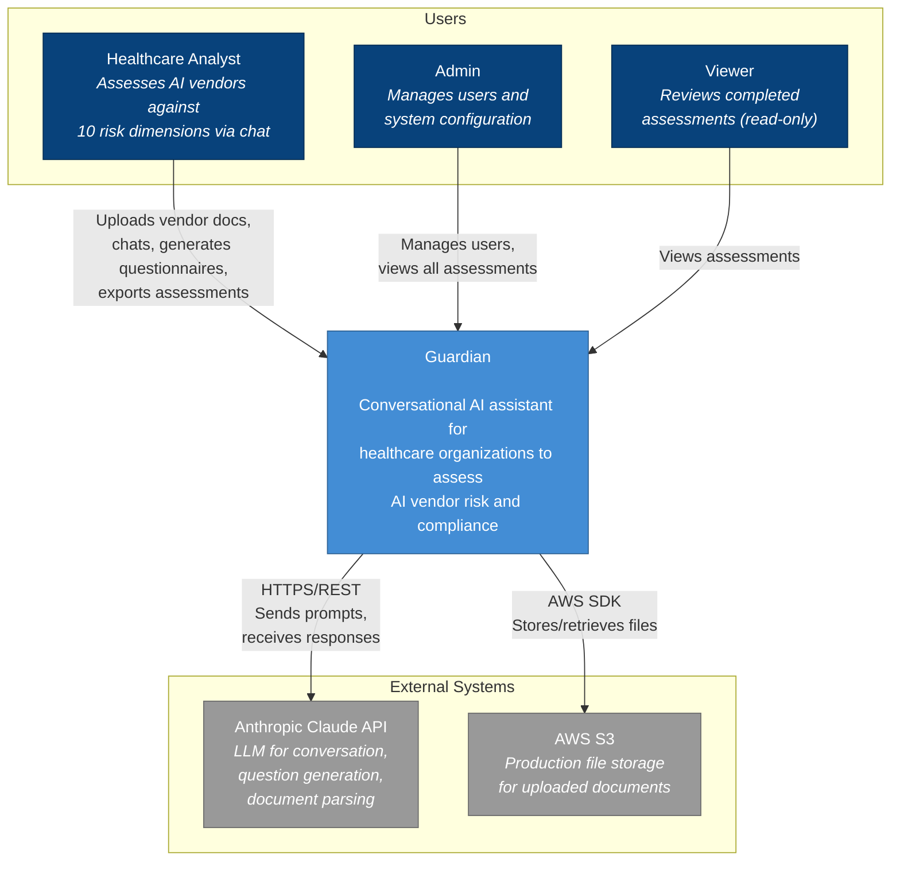
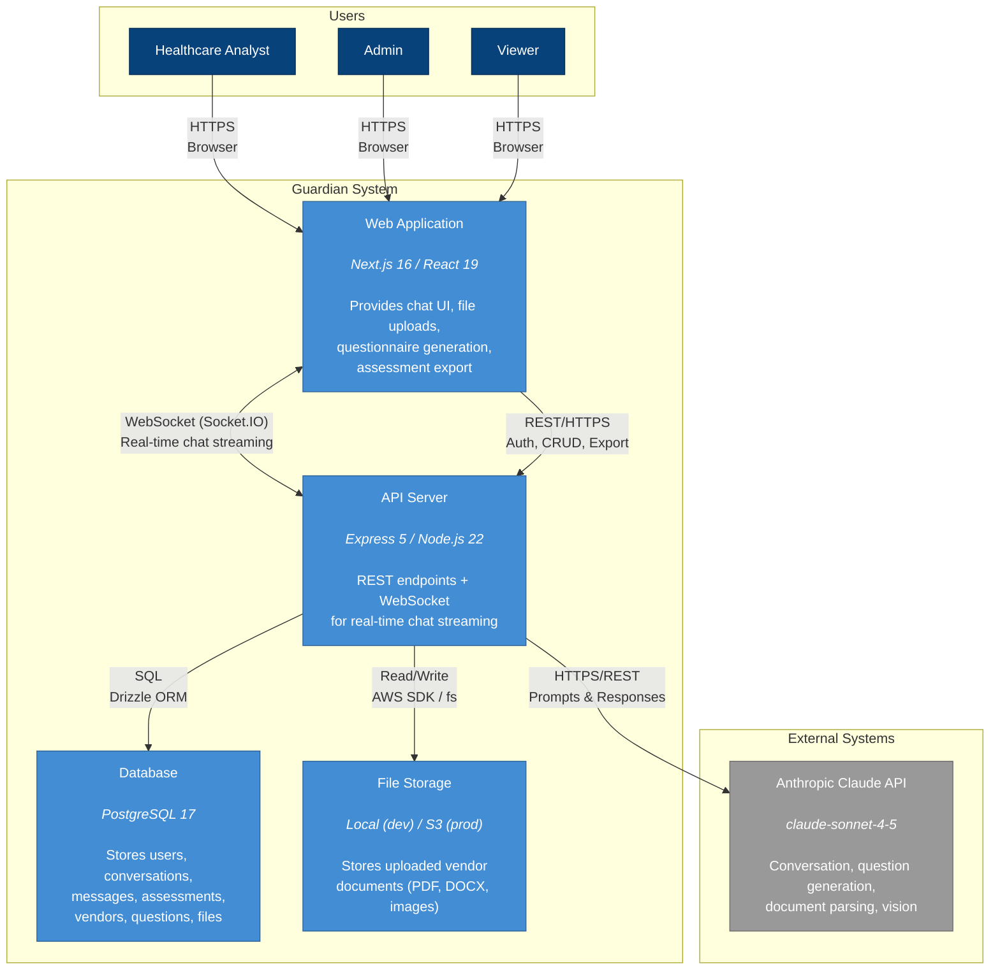

# Guardian C4 Architecture Diagrams

> **Last Updated:** 2025-12-19
> **Mermaid Version:** 11.4.1+

This document contains the C4 model diagrams for Guardian at four zoom levels.

---

## C1 - System Context

The highest level view showing Guardian as a single system with its users and external dependencies.

### C1 Summary

| Element | Type | Description |
|---------|------|-------------|
| Healthcare Analyst | User | Primary user - assesses vendors via chat |
| Admin | User | Manages users, system config |
| Viewer | User | Read-only access to assessments |
| Guardian | System | Core application |
| Anthropic Claude API | External | LLM for AI features |
| AWS S3 | External | Production file storage |

---

## C2 - Container Diagram

Zooms into Guardian to show the major technical building blocks.

### C2 Summary

| Container | Technology | Responsibility |
|-----------|------------|----------------|
| Web Application | Next.js 16 / React 19 | Chat UI, file uploads, mode switching, export downloads |
| API Server | Express 5 / Node.js 22 | REST + WebSocket, auth, business logic, AI orchestration |
| Database | PostgreSQL 17 + Drizzle | 7 tables: users, conversations, messages, vendors, assessments, questions, files |
| File Storage | Local / AWS S3 | Uploaded documents with intake context parsing |

### Protocols

| Connection | Protocol | Purpose |
|------------|----------|---------|
| Browser ↔ Web App | HTTPS | Static assets, SSR |
| Web App ↔ API | WebSocket (Socket.IO) | Real-time chat streaming |
| Web App ↔ API | REST/HTTPS | Auth, CRUD, file upload/download |
| API ↔ Database | SQL (Drizzle ORM) | Data persistence |
| API ↔ Storage | fs / AWS SDK | File operations |
| API ↔ Claude | HTTPS/REST | LLM prompts and responses |

---

## C3 - Web Application Components

Zooms into the Web Application container to show internal components.

```mermaid
flowchart TB
    subgraph webapp["Web Application (Next.js 16 / React 19)"]

        subgraph pages["Pages & Layout"]
            chatPage["ChatPage<br><i>Main chat interface route</i>"]
            authPages["Auth Pages<br><i>Login, Register</i>"]
            layout["Layout<br><i>Sidebar + main content</i>"]
        end

        subgraph components["UI Components"]
            chatInterface["ChatInterface<br><i>Orchestrates chat experience</i>"]
            composer["Composer<br><i>Message input + ModeSelector</i>"]
            messageList["MessageList<br><i>Renders conversation history</i>"]
            sidebar["Sidebar<br><i>ConversationList + Search</i>"]
            stepper["VerticalStepper<br><i>Generation phase progress</i>"]
            questionnaireCard["QuestionnairePromptCard<br><i>Inline questionnaire trigger</i>"]
            downloadBubble["DownloadBubble<br><i>Export ready notification</i>"]
            fileChip["FileChip<br><i>Composer file preview</i>"]
            fileChipInChat["FileChipInChat<br><i>Message attachment display</i>"]
        end

        subgraph hooks["Hooks & Controllers"]
            useChatController["useChatController<br><i>Central chat orchestration</i>"]
            useWebSocketAdapter["useWebSocketAdapter<br><i>Socket.IO connection</i>"]
            useWebSocketEvents["useWebSocketEvents<br><i>Event handlers</i>"]
            useHistoryManager["useHistoryManager<br><i>Message history</i>"]
            useConversationSync["useConversationSync<br><i>Conversation state sync</i>"]
            useConversationMode["useConversationMode<br><i>consult/assessment toggle</i>"]
            useAuth["useAuth<br><i>JWT token management</i>"]
            useFileUpload["useFileUpload<br><i>Single file upload</i>"]
            useMultiFileUpload["useMultiFileUpload<br><i>Multi-file upload</i>"]
            useQuestionnairePersistence["useQuestionnairePersistence<br><i>localStorage cache</i>"]
        end

        subgraph state["State Management"]
            chatStore["Zustand chatStore<br><i>messages, pendingQuestionnaire,<br>generationSteps, exportReady,<br>pendingFiles, uploadProgress</i>"]
        end

        subgraph services["Frontend Services"]
            chatService["ChatService<br><i>Send messages, abort stream</i>"]
            conversationService["ConversationService<br><i>CRUD conversations</i>"]
            wsClient["WebSocketClient<br><i>Socket.IO wrapper</i>"]
        end

    end

    subgraph external["External (API Server)"]
        restApi["REST API<br><i>/api/auth, /api/documents</i>"]
        wsServer["WebSocket Server<br><i>/chat namespace</i>"]
    end

    %% Page to Component relationships
    chatPage --> chatInterface
    chatPage --> sidebar
    layout --> sidebar

    %% Component to Hook relationships
    chatInterface --> useChatController
    composer --> useMultiFileUpload
    composer --> useChatController
    messageList --> chatStore
    sidebar --> useChatController
    stepper --> chatStore
    questionnaireCard --> chatStore
    downloadBubble --> chatStore
    fileChip --> useMultiFileUpload
    fileChipInChat --> chatStore

    %% Hook orchestration
    useChatController --> chatService
    useChatController --> conversationService
    useChatController --> useWebSocketAdapter
    useChatController --> useWebSocketEvents
    useChatController --> useHistoryManager
    useChatController --> useConversationSync
    useChatController --> useConversationMode
    useChatController --> useQuestionnairePersistence
    useChatController --> chatStore
    useMultiFileUpload --> chatStore
    useFileUpload --> chatStore
    useAuth --> chatStore

    %% Service to WebSocket
    chatService --> useWebSocketAdapter
    conversationService --> useWebSocketAdapter
    useWebSocketAdapter --> wsClient

    %% External connections
    wsClient <-->|"Socket.IO"| wsServer
    useAuth -->|"REST/HTTPS"| restApi
    useMultiFileUpload -->|"REST/HTTPS<br>multipart/form-data"| restApi

    style chatStore fill:#F9A825,stroke:#F57F17,color:#000
    style useChatController fill:#7B1FA2,stroke:#4A148C,color:#fff
    style wsClient fill:#1976D2,stroke:#0D47A1,color:#fff
```

### C3 Web App Summary

| Layer | Components | Responsibility |
|-------|------------|----------------|
| Pages | ChatPage, AuthPages, Layout | Route entry points |
| UI Components | ChatInterface, Composer, MessageList, Sidebar, Stepper, FileChips | Visual presentation |
| Hooks | useChatController (orchestrator), useWebSocket*, useAuth, useFileUpload | Behavior & state logic |
| State | Zustand chatStore | Global reactive state |
| Services | ChatService, ConversationService, WebSocketClient | API communication |

### Key Patterns

- `useChatController` is the **central orchestrator** - all other hooks feed into it
- Components read from `chatStore`, hooks write to it
- `WebSocketClient` handles all real-time communication
- File uploads go directly to REST API (multipart), not WebSocket

---

## C3 - API Server Components

Zooms into the API Server container to show internal components.

```mermaid
flowchart TB
    subgraph api["API Server (Express 5 / Node.js 22)"]

        subgraph http["HTTP Layer"]
            authController["AuthController<br><i>Login, register, refresh</i>"]
            vendorController["VendorController<br><i>Vendor CRUD</i>"]
            assessmentController["AssessmentController<br><i>Assessment CRUD</i>"]
            questionController["QuestionController<br><i>Question CRUD</i>"]
            exportController["ExportController<br><i>PDF/Word/Excel export</i>"]
            documentController["DocumentUploadController<br><i>Upload, download files</i>"]
        end

        subgraph websocket["WebSocket Layer (/chat)"]
            chatServer["ChatServer<br><i>Real-time chat namespace<br>+ formatMultiDocContextForClaude<br>+ sanitizeForPrompt</i>"]
            rateLimiter["RateLimiter<br><i>Per-user rate limits</i>"]
        end

        subgraph services["Application Services"]
            authService["AuthService<br><i>JWT auth, password hashing</i>"]
            conversationService["ConversationService<br><i>Conversation lifecycle</i>"]
            assessmentService["AssessmentService<br><i>Assessment logic</i>"]
            vendorService["VendorService<br><i>Vendor management</i>"]
            questionService["QuestionService<br><i>Legacy question gen</i>"]
            questionnaireReadyService["QuestionnaireReadyService<br><i>Tool call handler</i>"]
            questionnaireGenService["QuestionnaireGenerationService<br><i>Structured generation</i>"]
            exportService["ExportService<br><i>Export orchestration</i>"]
            fileValidationService["FileValidationService<br><i>Magic bytes, MIME, size</i>"]
        end

        subgraph ai["AI & Parsing"]
            claudeClient["ClaudeClient<br><i>Anthropic SDK wrapper</i>"]
            promptCacheManager["PromptCacheManager<br><i>Tool-aware caching</i>"]
            documentParser["DocumentParserService<br><i>Intake + scoring parsing</i>"]
            visionClient["VisionClient<br><i>Image analysis</i>"]
            assessmentTools["assessmentModeTools<br><i>questionnaire_ready tool</i>"]
            questionnaireSchema["QuestionnaireSchemaAdapter<br><i>Structured JSON output</i>"]
            markdownConverter["questionnaireToMarkdown<br><i>Render for chat</i>"]
        end

        subgraph data["Data Layer"]
            userRepo["UserRepository"]
            conversationRepo["ConversationRepository"]
            messageRepo["MessageRepository"]
            vendorRepo["VendorRepository"]
            assessmentRepo["AssessmentRepository"]
            questionRepo["QuestionRepository"]
            fileRepo["FileRepository"]
            jwtProvider["JWTProvider"]
        end

        subgraph exporters["Export Generators"]
            pdfExporter["PDFExporter"]
            wordExporter["WordExporter"]
            excelExporter["ExcelExporter"]
        end

        subgraph storage["File Storage"]
            storageFactory["createFileStorage()"]
            localStorage["LocalFileStorage<br><i>(development)</i>"]
            s3Storage["S3FileStorage<br><i>(production)</i>"]
        end

    end

    subgraph external["External Systems"]
        db["PostgreSQL 17"]
        claudeApi["Anthropic Claude API"]
        s3["AWS S3"]
    end

    %% HTTP Controller relationships
    authController --> authService
    vendorController --> vendorService
    assessmentController --> assessmentService
    questionController --> questionService
    exportController --> exportService
    documentController --> fileValidationService
    documentController --> fileRepo
    documentController --> storageFactory
    documentController --> documentParser

    %% WebSocket relationships
    chatServer --> rateLimiter
    chatServer --> conversationService
    chatServer --> questionnaireReadyService
    chatServer --> questionnaireGenService
    chatServer --> promptCacheManager
    chatServer --> fileRepo

    %% Service to AI relationships
    promptCacheManager --> claudeClient
    questionnaireGenService --> claudeClient
    questionnaireGenService --> questionnaireSchema
    questionnaireGenService --> assessmentService
    questionnaireGenService --> vendorService
    questionnaireGenService --> markdownConverter
    documentParser --> claudeClient
    documentParser --> visionClient

    %% Service to Repository relationships
    authService --> userRepo
    authService --> jwtProvider
    conversationService --> conversationRepo
    conversationService --> messageRepo
    assessmentService --> assessmentRepo
    vendorService --> vendorRepo
    questionService --> questionRepo
    questionnaireSchema --> questionRepo
    exportService --> exporters

    %% Storage relationships
    storageFactory --> localStorage
    storageFactory --> s3Storage

    %% External connections
    userRepo --> db
    conversationRepo --> db
    messageRepo --> db
    vendorRepo --> db
    assessmentRepo --> db
    questionRepo --> db
    fileRepo --> db
    claudeClient --> claudeApi
    visionClient --> claudeApi
    s3Storage --> s3

    style chatServer fill:#7B1FA2,stroke:#4A148C,color:#fff
    style claudeClient fill:#1976D2,stroke:#0D47A1,color:#fff
    style promptCacheManager fill:#F9A825,stroke:#F57F17,color:#000
    style documentParser fill:#43A047,stroke:#2E7D32,color:#fff
```

### C3 API Server Summary

| Layer | Components | Responsibility |
|-------|------------|----------------|
| HTTP Controllers | Auth, Vendor, Assessment, Question, Export, DocumentUpload | REST endpoint handlers |
| WebSocket | ChatServer, RateLimiter | Real-time chat, streaming, rate limiting |
| Services | Auth, Conversation, Assessment, Vendor, Question, QuestionnaireGen, Export, FileValidation | Business logic orchestration |
| AI & Parsing | ClaudeClient, PromptCacheManager, DocumentParser, VisionClient | LLM integration, document extraction |
| Data Layer | 7 Repositories + JWTProvider | Database access via Drizzle ORM |
| Exporters | PDF, Word, Excel | Document generation |
| Storage | Factory → Local/S3 | File persistence abstraction |

### Key Patterns

- `ChatServer` is the **WebSocket orchestrator** - handles all real-time events
- `PromptCacheManager` optimizes Claude API calls with caching
- `DocumentParserService` uses both ClaudeClient (text) and VisionClient (images)
- Storage factory pattern enables dev/prod environment switching

---

## Database Schema (Reference)

For complete database schema, see [database-schema.md](../design/data/database-schema.md).

### Tables Overview

| Table | Description |
|-------|-------------|
| users | User accounts and auth |
| conversations | Chat sessions |
| messages | Chat messages with attachments |
| vendors | Vendor records |
| assessments | Assessment records |
| questions | Generated questionnaire questions |
| files | Uploaded documents with intake context |

---

## Epic 16/17 Additions

Components added in Epic 16 (Document Parser) and Epic 17 (Multi-File Upload):

### Frontend
- `FileChip` - Composer file preview
- `FileChipInChat` - Message attachment display
- `useFileUpload` - Single file upload hook
- `useMultiFileUpload` - Multi-file upload hook
- `pendingFiles`, `uploadProgress` state in chatStore

### Backend
- `DocumentUploadController` - Upload/download endpoints
- `FileValidationService` - Magic bytes, MIME, size validation
- `DocumentParserService` - Intake + scoring parsing
- `VisionClient` - Image analysis via Claude Vision
- `FileRepository` - File database operations
- `LocalFileStorage` / `S3FileStorage` - File persistence

### WebSocket Events
- `upload_progress` - File processing progress
- `intake_context_ready` - Parsed document context
- `scoring_parse_ready` - Questionnaire response extraction

### Database
- `files` table with `intake_context`, `intake_gap_categories`, `intake_parsed_at`
