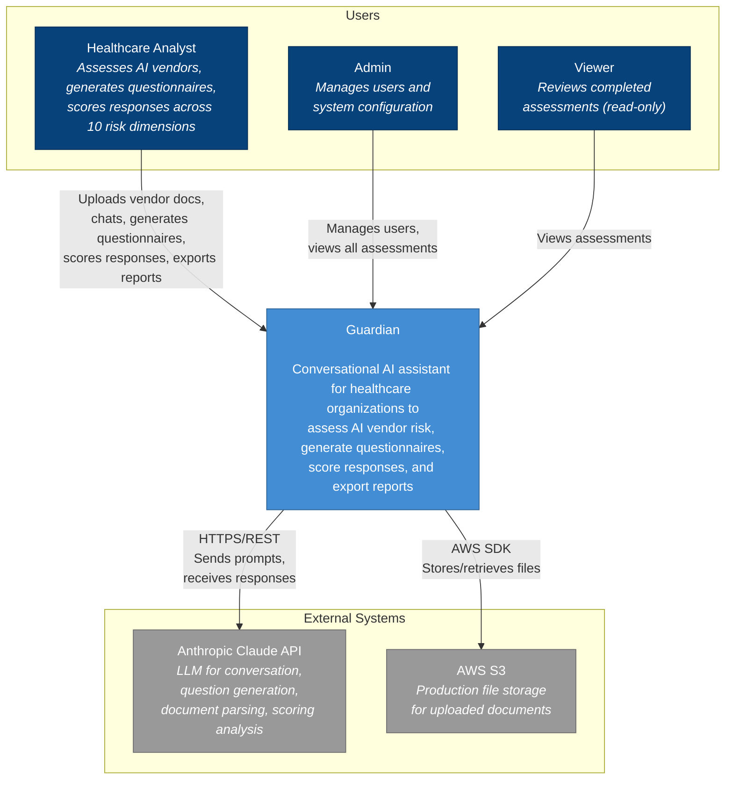
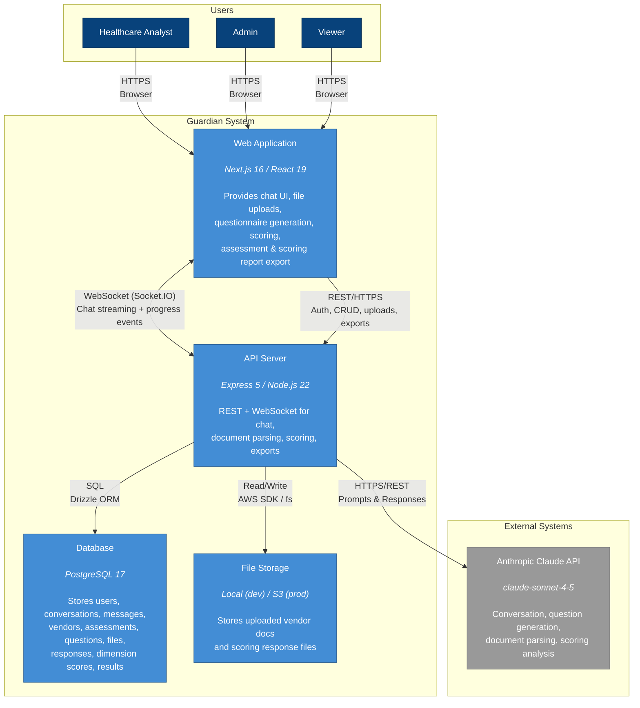

# Guardian C4 Architecture Diagrams

> **Last Updated:** 2026-01-20
> **Mermaid Version:** 11.4.1+

This document contains the C4 model diagrams for Guardian at four zoom levels.

---

## C1 - System Context

The highest level view showing Guardian as a single system with its users and external dependencies.

### C1 Summary

| Element | Type | Description |
|---------|------|-------------|
| Healthcare Analyst | User | Primary user - assesses vendors, scores responses, exports reports |
| Admin | User | Manages users, system config |
| Viewer | User | Read-only access to assessments |
| Guardian | System | Core application |
| Anthropic Claude API | External | LLM for chat, parsing, questionnaire generation, scoring |
| AWS S3 | External | Production file storage |

---

## C2 - Container Diagram

Zooms into Guardian to show the major technical building blocks.

### C2 Summary

| Container | Technology | Responsibility |
|-----------|------------|----------------|
| Web Application | Next.js 16 / React 19 | Chat UI, file uploads, questionnaire generation, scoring, export downloads |
| API Server | Express 5 / Node.js 22 | REST + WebSocket, auth, business logic, document parsing, scoring analysis |
| Database | PostgreSQL 17 + Drizzle | 10 tables: users, conversations, messages, vendors, assessments, questions, files, responses, dimension_scores, assessment_results |
| File Storage | Local / AWS S3 | Uploaded intake + scoring documents |

### Protocols

| Connection | Protocol | Purpose |
|------------|----------|---------|
| Browser ↔ Web App | HTTPS | Static assets, SSR |
| Web App ↔ API | WebSocket (Socket.IO) | Real-time chat streaming, generation phases, intake/scoring progress |
| Web App ↔ API | REST/HTTPS | Auth, CRUD, file upload/download, export |
| API ↔ Database | SQL (Drizzle ORM) | Data persistence |
| API ↔ Storage | fs / AWS SDK | File operations |
| API ↔ Claude | HTTPS/REST | LLM prompts and responses |

---

## C3 - Web Application Components

Zooms into the Web Application container to show internal components.

```mermaid
flowchart TB
    subgraph webapp["Web Application (Next.js 16 / React 19)"]

        subgraph pages["Pages & Layout"]
            chatPage["ChatPage<br><i>Main chat interface route</i>"]
            authPages["Auth Pages<br><i>Login, Register</i>"]
            layout["Layout<br><i>Sidebar + main content</i>"]
        end

        subgraph components["UI Components"]
            chatInterface["ChatInterface<br><i>Orchestrates chat experience</i>"]
            composer["Composer<br><i>Message input + ModeSelector</i>"]
            messageList["MessageList<br><i>ChatMessage + QuestionnaireMessage</i>"]
            sidebar["Sidebar<br><i>ConversationList + Search</i>"]
            stepper["VerticalStepper<br><i>Generation phase progress</i>"]
            questionnaireCard["QuestionnairePromptCard<br><i>Inline questionnaire trigger</i>"]
            downloadButton["DownloadButton<br><i>Questionnaire/Scoring export</i>"]
            scoringCard["ScoringResultCard<br><i>ScoreDashboard + recommendations</i>"]
            fileChip["FileChip<br><i>Composer file preview</i>"]
            fileChipInChat["FileChipInChat<br><i>Message attachment display</i>"]
        end

        subgraph hooks["Hooks & Controllers"]
            useChatController["useChatController<br><i>Central chat orchestration</i>"]
            useWebSocketAdapter["useWebSocketAdapter<br><i>Socket.IO adapter</i>"]
            useWebSocketEvents["useWebSocketEvents<br><i>Event handlers</i>"]
            useHistoryManager["useHistoryManager<br><i>Message history</i>"]
            useConversationSync["useConversationSync<br><i>Conversation state sync</i>"]
            useConversationMode["useConversationMode<br><i>consult/assessment/scoring</i>"]
            useAuth["useAuth<br><i>JWT token management</i>"]
            useFileUpload["useFileUpload<br><i>Intake/scoring upload</i>"]
            useMultiFileUpload["useMultiFileUpload<br><i>Multi-file upload</i>"]
            useQuestionnairePersistence["useQuestionnairePersistence<br><i>localStorage cache</i>"]
        end

        subgraph state["State Management"]
            chatStore["Zustand chatStore<br><i>messages, pendingQuestionnaire,<br>generationSteps, exportReadyByConversation,<br>pendingFiles, uploadProgress,<br>scoringProgress, scoringResult</i>"]
        end

        subgraph services["Frontend Services"]
            chatService["ChatService<br><i>Send messages, abort stream</i>"]
            conversationService["ConversationService<br><i>CRUD conversations</i>"]
            wsClient["WebSocketClient<br><i>Socket.IO wrapper</i>"]
        end

    end

    subgraph external["External (API Server)"]
        restApi["REST API<br><i>/api/auth, /api/documents,<br>/api/export, /api/export/scoring</i>"]
        wsServer["WebSocket Server<br><i>/chat namespace</i>"]
    end

    %% Page to Component relationships
    chatPage --> chatInterface
    chatPage --> sidebar
    layout --> sidebar

    %% Component to Hook relationships
    chatInterface --> useChatController
    composer --> useMultiFileUpload
    composer --> useChatController
    messageList --> chatStore
    sidebar --> useChatController
    stepper --> chatStore
    questionnaireCard --> chatStore
    scoringCard --> chatStore
    fileChip --> useMultiFileUpload
    fileChipInChat --> chatStore
    downloadButton --> useAuth

    %% Hook orchestration
    useChatController --> chatService
    useChatController --> conversationService
    useChatController --> useWebSocketAdapter
    useChatController --> useWebSocketEvents
    useChatController --> useHistoryManager
    useChatController --> useConversationSync
    useChatController --> useConversationMode
    useChatController --> useQuestionnairePersistence
    useChatController --> chatStore
    useMultiFileUpload --> chatStore
    useFileUpload --> chatStore

    %% Service to WebSocket
    chatService --> useWebSocketAdapter
    conversationService --> useWebSocketAdapter
    useWebSocketAdapter --> wsClient

    %% External connections
    wsClient <-->|"Socket.IO"| wsServer
    useAuth -->|"REST/HTTPS"| restApi
    useMultiFileUpload -->|"REST/HTTPS<br>multipart/form-data"| restApi

    style chatStore fill:#F9A825,stroke:#F57F17,color:#000
    style useChatController fill:#7B1FA2,stroke:#4A148C,color:#fff
    style wsClient fill:#1976D2,stroke:#0D47A1,color:#fff
```

### C3 Web App Summary

| Layer | Components | Responsibility |
|-------|------------|----------------|
| Pages | ChatPage, AuthPages, Layout | Route entry points |
| UI Components | ChatInterface, Composer, MessageList, Sidebar, Stepper, QuestionnairePromptCard, ScoringResultCard, FileChips | Visual presentation |
| Hooks | useChatController (orchestrator), useWebSocketAdapter/useWebSocketEvents, useConversationMode, useFileUpload/useMultiFileUpload | Behavior & state logic |
| State | Zustand chatStore | Global reactive state (messages, uploads, scoring) |
| Services | ChatService, ConversationService, WebSocketClient | API communication |

### Key Patterns

- `useChatController` is the **central orchestrator** - all other hooks feed into it
- Components read from `chatStore`, hooks write to it
- `WebSocketClient` handles all real-time communication
- File uploads go directly to REST API (multipart), not WebSocket
- Scoring results persist per conversation in `chatStore` for cross-session viewing

---

## C3 - API Server Components

Zooms into the API Server container to show internal components.

```mermaid
flowchart TB
    subgraph api["API Server (Express 5 / Node.js 22)"]

        subgraph http["HTTP Layer"]
            authController["AuthController<br><i>Login, register, refresh</i>"]
            vendorController["VendorController<br><i>Vendor CRUD</i>"]
            assessmentController["AssessmentController<br><i>Assessment CRUD + status</i>"]
            questionController["QuestionController<br><i>Question CRUD</i>"]
            exportController["ExportController<br><i>Questionnaire export</i>"]
            scoringExportController["ScoringExportController<br><i>Scoring report export</i>"]
            documentController["DocumentUploadController<br><i>Upload, download, parse</i>"]
        end

        subgraph websocket["WebSocket Layer (/chat) - Epic 28 Modular"]
            chatServer["ChatServer<br><i>Orchestrator</i>"]

            subgraph handlers["Handlers"]
                connectionHandler["ConnectionHandler"]
                messageHandler["MessageHandler"]
                conversationHandler["ConversationHandler"]
                modeSwitchHandler["ModeSwitchHandler"]
                questionnaireHandler["QuestionnaireHandler"]
                scoringHandler["ScoringHandler"]
            end

            subgraph modeStrategies["Mode Strategies"]
                consultStrategy["ConsultModeStrategy"]
                assessmentStrategy["AssessmentModeStrategy"]
                scoringStrategy["ScoringModeStrategy"]
            end

            subgraph contextBuilders["Context Builders"]
                convContextBuilder["ConversationContextBuilder"]
                fileContextBuilder["FileContextBuilder"]
            end

            subgraph wsUtils["Utilities"]
                streamingHandler["StreamingHandler"]
                toolUseRegistry["ToolUseRegistry"]
                rateLimiter["RateLimiter"]
            end
        end

        subgraph services["Application Services"]
            authService["AuthService<br><i>JWT auth, password hashing</i>"]
            conversationService["ConversationService<br><i>Conversation lifecycle</i>"]
            assessmentService["AssessmentService<br><i>Assessment logic</i>"]
            vendorService["VendorService<br><i>Vendor management</i>"]
            questionService["QuestionService<br><i>Legacy question gen</i>"]
            questionnaireReadyService["QuestionnaireReadyService<br><i>Tool call handler</i>"]
            questionnaireGenService["QuestionnaireGenerationService<br><i>Structured generation</i>"]
            exportService["ExportService<br><i>Questionnaire export</i>"]
            scoringService["ScoringService<br><i>Parse + score responses</i>"]
            scoringExportService["ScoringExportService<br><i>Scoring report export</i>"]
            fileValidationService["FileValidationService<br><i>Magic bytes, MIME, size</i>"]
        end

        subgraph ai["AI & Parsing"]
            claudeClient["ClaudeClient<br><i>Anthropic SDK wrapper (LLM + Vision)</i>"]
            promptCacheManager["PromptCacheManager<br><i>Tool-aware caching</i>"]
            documentParser["DocumentParserService<br><i>Intake + scoring parsing</i>"]
            scoringPromptBuilder["ScoringPromptBuilder<br><i>Scoring prompt assembly</i>"]
            assessmentTools["assessmentModeTools<br><i>questionnaire_ready tool</i>"]
            questionnaireSchema["QuestionnaireSchemaAdapter<br><i>Schema to Question mapping</i>"]
            markdownConverter["questionnaireToMarkdown<br><i>Render for chat</i>"]
        end

        subgraph data["Data Layer"]
            userRepo["UserRepository"]
            conversationRepo["ConversationRepository"]
            messageRepo["MessageRepository"]
            vendorRepo["VendorRepository"]
            assessmentRepo["AssessmentRepository"]
            questionRepo["QuestionRepository"]
            fileRepo["FileRepository"]
            responseRepo["ResponseRepository"]
            dimensionScoreRepo["DimensionScoreRepository"]
            assessmentResultRepo["AssessmentResultRepository"]
            jwtProvider["JWTProvider"]
        end

        subgraph exporters["Export Generators"]
            pdfExporter["PDFExporter"]
            wordExporter["WordExporter"]
            excelExporter["ExcelExporter"]
            scoringPdfExporter["ScoringPDFExporter"]
            scoringWordExporter["ScoringWordExporter"]
        end

        subgraph storage["File Storage"]
            storageFactory["createFileStorage()"]
            localStorage["LocalFileStorage<br><i>(development)</i>"]
            s3Storage["S3FileStorage<br><i>(production)</i>"]
        end

    end

    subgraph external["External Systems"]
        db["PostgreSQL 17"]
        claudeApi["Anthropic Claude API"]
        s3["AWS S3"]
    end

    %% HTTP Controller relationships
    authController --> authService
    vendorController --> vendorService
    assessmentController --> assessmentService
    questionController --> questionService
    exportController --> exportService
    scoringExportController --> scoringExportService
    documentController --> fileValidationService
    documentController --> fileRepo
    documentController --> storageFactory
    documentController --> documentParser
    documentController --> scoringService

    %% WebSocket relationships (Epic 28 modular)
    chatServer --> connectionHandler
    chatServer --> messageHandler
    chatServer --> conversationHandler
    chatServer --> modeSwitchHandler
    chatServer --> questionnaireHandler
    chatServer --> scoringHandler
    chatServer --> rateLimiter

    messageHandler --> consultStrategy
    messageHandler --> assessmentStrategy
    messageHandler --> scoringStrategy
    messageHandler --> convContextBuilder
    messageHandler --> fileContextBuilder
    messageHandler --> streamingHandler
    messageHandler --> toolUseRegistry
    messageHandler --> promptCacheManager

    conversationHandler --> conversationService
    questionnaireHandler --> questionnaireReadyService
    questionnaireHandler --> questionnaireGenService
    scoringHandler --> scoringService

    %% Service to AI relationships
    promptCacheManager --> claudeClient
    questionnaireGenService --> claudeClient
    questionnaireGenService --> questionnaireSchema
    questionnaireGenService --> assessmentService
    questionnaireGenService --> vendorService
    questionnaireGenService --> markdownConverter
    documentParser --> claudeClient
    scoringService --> documentParser
    scoringService --> scoringPromptBuilder
    scoringService --> claudeClient

    %% Service to Repository relationships
    authService --> userRepo
    authService --> jwtProvider
    conversationService --> conversationRepo
    conversationService --> messageRepo
    assessmentService --> assessmentRepo
    vendorService --> vendorRepo
    questionService --> questionRepo
    questionnaireSchema --> questionRepo
    exportService --> exporters
    scoringExportService --> scoringPdfExporter
    scoringExportService --> scoringWordExporter
    scoringService --> responseRepo
    scoringService --> dimensionScoreRepo
    scoringService --> assessmentResultRepo
    scoringService --> assessmentRepo
    scoringService --> fileRepo
    scoringExportService --> assessmentResultRepo
    scoringExportService --> dimensionScoreRepo
    scoringExportService --> assessmentRepo

    %% Storage relationships
    storageFactory --> localStorage
    storageFactory --> s3Storage

    %% External connections
    userRepo --> db
    conversationRepo --> db
    messageRepo --> db
    vendorRepo --> db
    assessmentRepo --> db
    questionRepo --> db
    fileRepo --> db
    responseRepo --> db
    dimensionScoreRepo --> db
    assessmentResultRepo --> db
    claudeClient --> claudeApi
    s3Storage --> s3

    style chatServer fill:#7B1FA2,stroke:#4A148C,color:#fff
    style claudeClient fill:#1976D2,stroke:#0D47A1,color:#fff
    style promptCacheManager fill:#F9A825,stroke:#F57F17,color:#000
    style documentParser fill:#43A047,stroke:#2E7D32,color:#fff
```

### C3 API Server Summary

| Layer | Components | Responsibility |
|-------|------------|----------------|
| HTTP Controllers | Auth, Vendor, Assessment, Question, Export, ScoringExport, DocumentUpload | REST endpoint handlers |
| WebSocket (Epic 28) | ChatServer → Handlers (6) + Mode Strategies (3) + Context Builders (2) + Utilities | Real-time chat, streaming, rate limiting |
| Services | Auth, Conversation, Assessment, Vendor, Question, QuestionnaireGen, Export, Scoring, ScoringExport, FileValidation | Business logic orchestration |
| AI & Parsing | ClaudeClient, PromptCacheManager, DocumentParser, ScoringPromptBuilder | LLM integration, document extraction |
| Data Layer | 10 Repositories + JWTProvider | Database access via Drizzle ORM |
| Exporters | PDF, Word, Excel, Scoring PDF/Word | Document generation |
| Storage | Factory → Local/S3 | File persistence abstraction |

### Key Patterns

- `ChatServer` is the **WebSocket orchestrator** - delegates to specialized handlers (Epic 28)
- **Handlers** separate concerns: Connection, Message, Conversation, ModeSwitch, Questionnaire, Scoring
- **Mode Strategies** encapsulate mode-specific behavior: Consult, Assessment, Scoring
- **Context Builders** construct Claude API context: Conversation history, File attachments
- `PromptCacheManager` optimizes Claude API calls with caching
- `DocumentParserService` uses ClaudeClient for both text and vision parsing (intake + scoring)
- `ScoringService` orchestrates parse -> LLM scoring -> persistence, triggered from uploads
- Storage factory pattern enables dev/prod environment switching

---

## Database Schema (Reference)

For complete database schema, see [database-schema.md](../design/data/database-schema.md).

### Tables Overview

| Table | Description |
|-------|-------------|
| users | User accounts and auth |
| conversations | Chat sessions |
| messages | Chat messages with attachments |
| vendors | Vendor records |
| assessments | Assessment records |
| questions | Generated questionnaire questions |
| files | Uploaded documents with intake context |
| responses | Parsed questionnaire responses |
| dimension_scores | Per-dimension scoring results |
| assessment_results | Scoring report summaries |

---

## Epic 15-17 Additions

### Epic 15 - Scoring & Analysis
Frontend:
- `ModeSelector` - Scoring mode
- `ScoringResultCard` + `ScoreDashboard` - Scoring results UI
- `DownloadButton` - Scoring report exports
- `scoringProgress`, `scoringResult`, `scoringResultByConversation` state in chatStore

Backend:
- `ScoringService` - Parse + score responses workflow
- `ScoringPromptBuilder` + `ScoringPayloadValidator` - Prompt assembly + validation
- `ScoringExportService` + `ScoringPDFExporter` + `ScoringWordExporter` - Scoring report exports
- `ScoringExportController` - Scoring export endpoints
- Auto-trigger scoring after successful scoring parse in `DocumentUploadController`

WebSocket Events:
- `scoring_started` - Scoring workflow started
- `scoring_progress` - Status updates
- `scoring_complete` - Final results payload
- `scoring_error` - Scoring failure

Database:
- `responses` table for parsed questionnaire responses
- `dimension_scores` table for per-dimension scores
- `assessment_results` table for report summaries

### Epic 16/17 - Document Parser + Multi-File Upload
Frontend:
- `FileChip` - Composer file preview
- `FileChipInChat` - Message attachment display
- `useFileUpload` - Single file upload hook (intake/scoring)
- `useMultiFileUpload` - Multi-file upload hook
- `pendingFiles`, `uploadProgress` state in chatStore

Backend:
- `DocumentUploadController` - Upload/download endpoints
- `FileValidationService` - Magic bytes, MIME, size validation
- `DocumentParserService` - Intake + scoring parsing
- `FileRepository` - File database operations
- `LocalFileStorage` / `S3FileStorage` - File persistence

WebSocket Events:
- `upload_progress` - File processing progress
- `intake_context_ready` - Parsed document context
- `scoring_parse_ready` - Questionnaire response extraction

Database:
- `files` table with `intake_context`, `intake_gap_categories`, `intake_parsed_at`
- `messages.attachments` JSONB for file references

### Epic 20 - Scoring Optimization & Narrative Generation

Backend:
- `narrativeStatus`, `narrativeClaimedAt`, `narrativeCompletedAt`, `narrativeError` fields in `assessment_results`
- Concurrency-safe claim pattern for narrative generation
- `ExportNarrativeGenerator` - Generates narrative reports with claim/release pattern
- Orphan cleanup for abandoned responses

Database:
- `assessment_results` table extended with narrative generation status tracking
- Indexes for efficient narrative status queries

### Epic 25 - Chat Title Intelligence

Frontend:
- Auto-generated conversation titles displayed in Sidebar
- Title updates after meaningful exchanges
- Manual title edit protection

Backend:
- `TitleGenerationService` - Generates conversation titles from message content
- `ConversationService.updateTitle()` - Updates title with manual edit flag

Database:
- `conversations.title` - Generated or user-edited title
- `conversations.title_manually_edited` - Prevents auto-updates from overwriting manual edits

WebSocket Events:
- `conversation_title_updated` - Title change notification

### Epic 28 - ChatServer Modular Refactoring

**Major architectural refactor** decomposing monolithic ChatServer into modular components.

Handlers (6):
| Handler | Responsibility |
|---------|----------------|
| `ConnectionHandler` | Socket connection, authentication, connection_ready events |
| `MessageHandler` | Core message processing, streaming, tool use orchestration |
| `ConversationHandler` | Conversation CRUD: create, list, delete, title generation |
| `ModeSwitchHandler` | Mode switching between consult, assessment, scoring |
| `QuestionnaireHandler` | Questionnaire generation, export status, export_ready events |
| `ScoringHandler` | Scoring workflow, vendor clarifications, scoring progress |

Mode Strategies (3):
| Strategy | Responsibility |
|----------|----------------|
| `ConsultModeStrategy` | Builds context for general Q&A mode |
| `AssessmentModeStrategy` | Builds context for questionnaire generation mode |
| `ScoringModeStrategy` | Builds context for response scoring mode |

Context Builders (2):
| Builder | Responsibility |
|---------|----------------|
| `ConversationContextBuilder` | Builds conversation context for Claude API calls |
| `FileContextBuilder` | Builds file/attachment context for Claude API calls |

Utilities:
| Utility | Responsibility |
|---------|----------------|
| `StreamingHandler` | Handles streaming responses from Claude to client |
| `ToolUseRegistry` | Tracks tool use blocks during Claude streaming responses |
| `ChatContext` | Shared context object for handler communication |

Benefits:
- Single Responsibility Principle - each handler has one job
- Testability - handlers can be unit tested in isolation
- Maintainability - changes to one concern don't affect others
- Extensibility - easy to add new handlers or strategies
