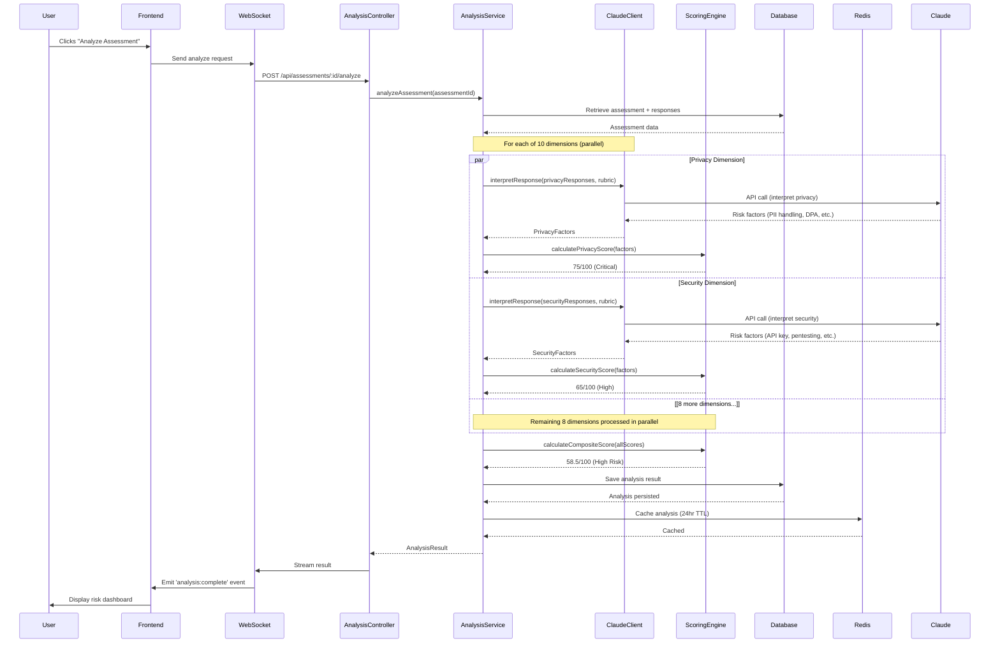
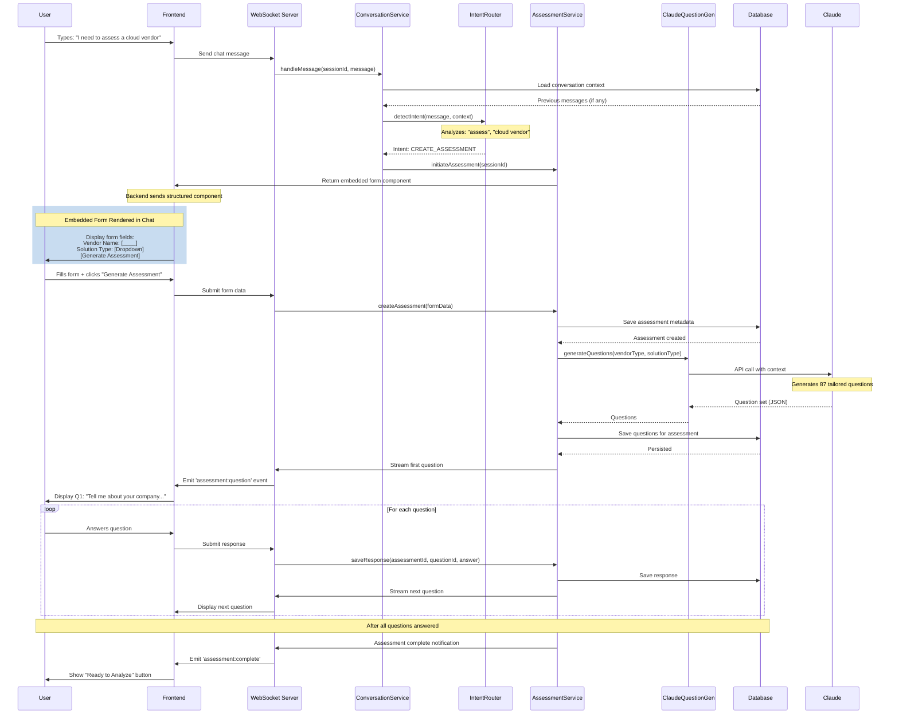

# Guardian Implementation Guide

**Version:** 1.2
**Last Updated:** 2026-01-29
**Status:** Active Development Reference

---

## Part of Guardian System Architecture

**Related Documents:**
- **Overview:** `overview.md` - High-level vision and goals
- **Architecture:** `architecture-layers.md` - Layers, modules, foundational patterns
- **Deployment:** `deployment-guide.md` - Infrastructure and deployment
- **Tasks:** `tasks/task-overview.md` - Current work and priorities
- **Quick Reference:** `CLAUDE.md` - Guardrails for Claude sessions

**Read `architecture-layers.md` FIRST** before using this guide.

---

## Folder Structure

### Monorepo Structure (Recommended for Guardian)

```
guardian-app/
├── apps/
│   └── web/                          # Next.js frontend (Presentation Layer)
│       ├── src/
│       │   ├── app/                  # App Router pages
│       │   │   ├── (auth)/          # Auth routes
│       │   │   ├── (dashboard)/     # Main app routes
│       │   │   ├── api/             # Next.js API routes (minimal, proxy only)
│       │   │   └── layout.tsx
│       │   ├── components/
│       │   │   ├── chat/            # Chat UI components
│       │   │   ├── dashboard/       # Dashboard components
│       │   │   ├── ui/              # Shadcn/ui components
│       │   │   └── shared/          # Shared components
│       │   ├── hooks/               # React hooks
│       │   ├── lib/                 # Frontend utilities
│       │   └── stores/              # Zustand stores
│       ├── public/
│       └── package.json
│
├── packages/
│   ├── backend/                     # Node.js backend (App + Domain + Infra)
│   │   └── src/
│   │       ├── application/         # Application Layer
│   │       │   ├── services/
│   │       │   │   ├── AssessmentService.ts
│   │       │   │   ├── AnalysisService.ts
│   │       │   │   ├── ReportService.ts
│   │       │   │   ├── ConversationService.ts
│   │       │   │   ├── PortfolioService.ts
│   │       │   │   └── AuthService.ts
│   │       │   ├── interfaces/      # Ports (contracts for infrastructure)
│   │       │   │   ├── IAssessmentRepository.ts
│   │       │   │   ├── IQuestionGenerator.ts
│   │       │   │   ├── IReportGenerator.ts
│   │       │   │   ├── IClaudeClient.ts
│   │       │   │   └── IVisionContentBuilder.ts  # Epic 30: Vision content interface
│   │       │   └── dtos/            # Data Transfer Objects
│   │       │       ├── CreateAssessmentDTO.ts
│   │       │       ├── AnalysisResultDTO.ts
│   │       │       └── ReportDTO.ts
│   │       │
│   │       ├── domain/              # Domain Layer (Business Logic)
│   │       │   ├── entities/
│   │       │   │   ├── Assessment.ts
│   │       │   │   ├── Vendor.ts
│   │       │   │   ├── RiskScore.ts
│   │       │   │   ├── Question.ts
│   │       │   │   └── Report.ts
│   │       │   ├── value-objects/
│   │       │   │   ├── Email.ts
│   │       │   │   ├── VendorName.ts
│   │       │   │   ├── RiskLevel.ts
│   │       │   │   └── ComplianceStatus.ts
│   │       │   ├── business-rules/
│   │       │   │   ├── calculateClinicalRisk.ts
│   │       │   │   ├── calculatePrivacyRisk.ts
│   │       │   │   ├── calculateSecurityRisk.ts
│   │       │   │   ├── [... 7 more risk calculators]
│   │       │   │   └── calculateCompositeScore.ts
│   │       │   └── errors/
│   │       │       ├── DomainError.ts
│   │       │       └── ValidationError.ts
│   │       │
│   │       ├── infrastructure/      # Infrastructure Layer
│   │       │   ├── http/
│   │       │   │   ├── server.ts    # Express/Fastify setup
│   │       │   │   ├── routes/
│   │       │   │   │   ├── assessment.routes.ts
│   │       │   │   │   ├── analysis.routes.ts
│   │       │   │   │   ├── portfolio.routes.ts
│   │       │   │   │   └── auth.routes.ts
│   │       │   │   ├── controllers/
│   │       │   │   │   ├── AssessmentController.ts
│   │       │   │   │   ├── ChatController.ts
│   │       │   │   │   └── PortfolioController.ts
│   │       │   │   └── middleware/
│   │       │   │       ├── auth.middleware.ts
│   │       │   │       ├── error.middleware.ts
│   │       │   │       └── validation.middleware.ts
│   │       │   │
│   │       │   ├── database/
│   │       │   │   ├── schema/
│   │       │   │   │   ├── assessments.ts
│   │       │   │   │   ├── vendors.ts
│   │       │   │   │   ├── conversations.ts
│   │       │   │   │   └── index.ts
│   │       │   │   ├── migrations/
│   │       │   │   ├── repositories/
│   │       │   │   │   ├── DrizzleAssessmentRepository.ts
│   │       │   │   │   ├── DrizzleVendorRepository.ts
│   │       │   │   │   └── DrizzleConversationRepository.ts
│   │       │   │   └── client.ts
│   │       │   │
│   │       │   ├── ai/
│   │       │   │   ├── ClaudeClient.ts           # Anthropic SDK wrapper (LLM + Vision)
│   │       │   │   ├── VisionContentBuilder.ts   # Epic 30: Image → ImageContentBlock
│   │       │   │   ├── ClaudeQuestionGenerator.ts
│   │       │   │   ├── ClaudeResponseInterpreter.ts
│   │       │   │   └── types/                    # Epic 30: Vision API types
│   │       │   │       ├── index.ts
│   │       │   │       ├── vision.ts             # ImageContentBlock, ContentBlock
│   │       │   │       └── message.ts            # ClaudeApiMessage
│   │       │   │
│   │       │   ├── websocket/
│   │       │   │   ├── ChatServer.ts
│   │       │   │   ├── StreamingHandler.ts
│   │       │   │   ├── handlers/                 # Epic 28: Modular handlers
│   │       │   │   │   ├── ConnectionHandler.ts  # Epic 30: Clears vision cache on disconnect
│   │       │   │   │   ├── ModeRouter.ts         # Epic 36: Mode config flags (replaces mode strategies)
│   │       │   │   │   └── ...
│   │       │   │   ├── services/                 # Epic 36: Send message pipeline
│   │       │   │   │   ├── SendMessageOrchestrator.ts  # 7-step pipeline
│   │       │   │   │   ├── SendMessageValidator.ts     # Validation + file readiness
│   │       │   │   │   ├── ClaudeStreamingService.ts   # Claude API streaming + tool loop
│   │       │   │   │   ├── ConsultToolLoopService.ts   # Web search tool loop (max 3 iterations)
│   │       │   │   │   ├── TitleUpdateService.ts       # Title generation
│   │       │   │   │   └── BackgroundEnrichmentService.ts # File enrichment
│   │       │   │   └── context/                  # Epic 28: Context builders
│   │       │   │       ├── FileContextBuilder.ts # Epic 30: buildWithImages() returns FileContextResult
│   │       │   │       └── ConversationContextBuilder.ts
│   │       │   │
│   │       │   ├── export/
│   │       │   │   ├── PDFExporter.ts        # Puppeteer/Playwright
│   │       │   │   ├── WordExporter.ts       # HTML to .docx
│   │       │   │   ├── ExcelExporter.ts      # ExcelJS
│   │       │   │   └── JSONSerializer.ts
│   │       │   │
│   │       │   └── external/
│   │       │       ├── EmailService.ts
│   │       │       └── StorageService.ts
│   │       │
│   │       ├── shared/               # Shared Kernel
│   │       │   ├── types/
│   │       │   │   ├── common.types.ts
│   │       │   │   └── api.types.ts
│   │       │   ├── utils/
│   │       │   │   ├── date.utils.ts
│   │       │   │   ├── string.utils.ts
│   │       │   │   └── validation.utils.ts
│   │       │   ├── config/
│   │       │   │   └── env.config.ts
│   │       │   └── errors/
│   │       │       ├── ApplicationError.ts
│   │       │       └── InfrastructureError.ts
│   │       │
│   │       ├── index.ts             # Server entry point
│   │       └── package.json
│   │
│   └── shared/                      # Shared types across frontend/backend
│       ├── src/
│       │   ├── types/               # Shared TypeScript types
│       │   └── constants/           # Shared constants
│       └── package.json
│
├── docs/                            # All documentation
├── .claude/                         # Claude Code config
├── tasks/                           # Task tracking
├── package.json                     # Monorepo root
├── turbo.json                       # Turborepo config (optional)
└── pnpm-workspace.yaml             # Package manager workspace config
```

---

## Technology Stack Decisions

### Stack Version Summary (January 2025)

**All components verified compatible:**

```json
{
  "engines": {
    "node": ">=22.11.0",
    "npm": ">=10.0.0"
  },
  "dependencies": {
    "next": "^16.0.0",
    "react": "^19.0.0",
    "tailwindcss": "^4.0.0",
    "express": "^5.1.0",
    "drizzle-orm": "latest",
    "drizzle-kit": "latest",
    "socket.io": "^4.8.1",
    "@anthropic-ai/sdk": "latest",
    "typescript": "^5.6.0"
  }
}
```

**Database:** PostgreSQL 17.x

---

### Frontend: Next.js 16 (UI Only)

**Version:** Next.js 16.x with App Router

**Why Next.js 16:**
- ✅ **Turbopack stable** (default bundler, 2-5x faster builds, 10x faster Fast Refresh)
- ✅ **React 19.2** with latest Server Components features
- ✅ **React Compiler stable** (automatic memoization, opt-in)
- ✅ **Built-in MCP support** (`/_next/mcp` endpoint for AI tooling)
- ✅ **Cache Components** (selective dynamic rendering within static pages)
- ✅ Typed routes (compile-time route safety)
- ✅ Excellent TypeScript 5.1+ support
- ✅ Easy deployment (Vercel)
- ✅ LLMs well-trained on Next.js patterns

**Why NOT using Next.js API routes for backend:**
- ❌ Harder to extract and test independently
- ❌ Tight coupling with frontend deployment
- ❌ Not enterprise-grade separation of concerns
- ❌ Difficult to scale backend independently

**Usage:** Next.js 16 for frontend ONLY. Separate Node.js backend for business logic.

**Styling:** Tailwind CSS v4.0 + Shadcn/ui (fully compatible)

**MCP Integration:** Next.js devtools MCP server for enhanced AI-assisted development

---

### Backend: Node.js 22 LTS + TypeScript + Express 5

**Version:** Node.js v22 LTS, Express v5.1.0

**Why Node.js 22 LTS:**
- ✅ Official Long Term Support (active through late 2025)
- ✅ Production-ready, enterprise-grade stability
- ✅ TypeScript shared between frontend/backend
- ✅ Excellent async/streaming support (critical for chat + Claude API)
- ✅ Rich ecosystem for WebSocket, AI SDKs

**Why Express 5.1.0:**
- ✅ Latest major version (modernized, improved performance)
- ✅ Requires Node.js 18+ (our v22 exceeds this)
- ✅ Middleware ecosystem mature
- ✅ Easy to find developers
- ✅ Can swap to Fastify later if performance needed (architecture supports this)

**Why NOT Next.js API routes:**
- Enterprise separation (frontend can be replaced without touching backend)
- Independent testing
- Independent deployment and scaling
- Clear module boundaries

---

### Database: PostgreSQL 17 with Drizzle ORM

**Version:** PostgreSQL 17.x, Drizzle ORM latest

**Why PostgreSQL 17:**
- ✅ Latest stable release (2024)
- ✅ Improved JSONB performance (critical for chat messages)
- ✅ Enhanced MERGE capabilities (useful for upserts)
- ✅ Better bulk loading performance
- ✅ Logical replication improvements
- ✅ Full-text search built-in
- ✅ Strong consistency (ACID)

**Why Drizzle ORM:**
- ✅ **SQL-first approach** - Full control over queries, no abstraction overhead
- ✅ **Lightweight** - ~30KB runtime (vs Drizzle's ~500KB)
- ✅ **No generation step** - TypeScript inference, instant dev loop
- ✅ **Better for complex queries** - Portfolio analytics, joins, aggregations easier
- ✅ **Repository pattern fit** - SQL-first aligns with clean architecture
- ✅ **Team familiarity** - Developer has Drizzle experience
- ✅ **Performance** - Faster query execution than Drizzle
- ✅ **Migration control** - Write SQL migrations manually (more control)

**Compatibility:** Works with Node.js 22, TypeScript 5.6+, PostgreSQL 17

**Alternatives considered:**
- Drizzle: Rejected (heavier, generation step, less SQL control)
- TypeORM: Viable, Drizzle chosen for performance and team familiarity
- Raw SQL (node-postgres): Viable, Drizzle chosen for type safety convenience

---

### Real-Time: WebSocket (Socket.IO v4.8.1)

**Version:** Socket.IO v4.8.1

**Why WebSocket:**
- ✅ Bi-directional (client can send messages anytime)
- ✅ Better for chat (user types → server responds)
- ✅ Connection persistence (less overhead than polling)
- ✅ Socket.IO provides fallbacks and reconnection
- ✅ Binary data support (if needed for file uploads)

**Why Socket.IO specifically:**
- ✅ Mature v4 series (stable)
- ✅ Compatible with Node.js 22
- ✅ Automatic reconnection on connection loss
- ✅ Fallback to HTTP long-polling if WebSocket unavailable

**Why NOT SSE:**
- ❌ Uni-directional (server → client only)
- ❌ Client must use separate HTTP for sending messages
- ❌ Less natural for chat UX

**Usage:** WebSocket for chat interface, REST for everything else (CRUD, analytics, exports)

---

### UI Framework: Tailwind CSS v4.0 + Shadcn/ui

**Version:** Tailwind CSS v4.0, Shadcn/ui latest

**Why Tailwind v4:**
- ✅ **3.78x faster builds** (378ms → 100ms full builds)
- ✅ **8.8x faster incremental builds** (44ms → 5ms)
- ✅ **Simpler setup** (single `@import "tailwindcss"`, no config file needed)
- ✅ **Lightning CSS** built-in (faster than PostCSS)
- ✅ **Modern features** (container queries, 3D transforms, radial gradients)
- ✅ **CSS-first configuration** with `@theme` directive
- ✅ **Better color palette** (`oklch` for wider gamut)

**Shadcn/ui Compatibility:**
- ✅ **Fully compatible as of November 2025**
- ✅ CLI initializes with v4 by default for new projects
- ✅ All components updated to support v4 natively
- ✅ Supports `@theme` directive
- ❌ No workarounds or hacks needed

**Why Shadcn/ui:**
- ✅ Accessible components (WCAG compliant)
- ✅ Customizable (not a component library, copy/paste approach)
- ✅ Chat-optimized components available
- ✅ Works perfectly with Next.js 15 + Tailwind v4

**Setup:** No `tailwind.config.js` needed with v4 - CSS-first configuration

---

### AI Integration: Anthropic Claude API (Direct)

**Version:** @anthropic-ai/sdk latest

**Why Direct API (not OpenRouter for production):**
- ✅ No middleman latency
- ✅ Official SDK with full feature support
- ✅ Direct support from Anthropic
- ✅ Prompt caching available (cost savings)
- ✅ Streaming support for real-time chat

**Why Anthropic Claude:**
- ✅ Superior instruction following for complex tasks
- ✅ Excellent with structured outputs (risk factor extraction)
- ✅ 200K context window (handles large assessment data)
- ✅ Strong on professional writing (reports)
- ✅ Sonnet 4.5 (claude-sonnet-4-5-20250929) is current model

**OpenRouter usage:** Demo/development only. Switch to direct API for production.

---

## Data Flow Examples

### Example 1: User Starts New Assessment

```
1. User clicks "New Assessment" button (Presentation)
   ↓
2. Frontend sends: POST /api/assessments { vendorName, type } (Presentation → Infrastructure)
   ↓
3. AssessmentController validates request (Infrastructure)
   ↓
4. Calls AssessmentService.createAssessment(dto) (Infrastructure → Application)
   ↓
5. AssessmentService creates Assessment entity (Application → Domain)
   ↓
6. Assessment.create() validates business rules (Domain)
   ↓
7. AssessmentService calls repo.save(assessment) (Application → Infrastructure via interface)
   ↓
8. DrizzleAssessmentRepository.save() persists to DB (Infrastructure)
   ↓
9. AssessmentService calls questionGen.generate() (Application → Infrastructure via interface)
   ↓
10. ClaudeQuestionGenerator calls Claude API (Infrastructure)
    ↓
11. Returns questions → Service → Controller → Frontend (reverse flow)
    ↓
12. Frontend renders questions in chat (Presentation)
```

**Layers crossed:** Presentation → Infrastructure → Application → Domain (and back)

---

### Example 2: Chat Message Flow

```
1. User types message in chat (Presentation)
   ↓
2. WebSocket sends message to ChatServer (Presentation → Infrastructure)
   ↓
3. ChatServer calls ConversationService.handleMessage() (Infrastructure → Application)
   ↓
4. ConversationService detects intent (Application)
   - "I need to assess..." → CREATE_ASSESSMENT intent
   ↓
5. Routes to AssessmentService (Application → Application)
   ↓
6. Returns response with embedded form component (Application → Infrastructure)
   ↓
7. ChatServer streams response via WebSocket (Infrastructure → Presentation)
   ↓
8. Frontend renders message + form component (Presentation)
```

---

### Example 3: Analysis Workflow

```
1. User submits completed assessment (Presentation)
   ↓
2. POST /api/assessments/:id/analyze (Presentation → Infrastructure)
   ↓
3. AnalysisController calls AnalysisService.analyze() (Infrastructure → Application)
   ↓
4. AnalysisService retrieves assessment (Application → Infrastructure → Domain)
   ↓
5. For each response, calls ClaudeClient.interpretResponse() (Application → Infrastructure)
   ↓
6. Claude returns structured risk factors (Infrastructure → Application)
   ↓
7. AnalysisService calls domain scoring functions (Application → Domain)
   - calculatePrivacyRisk(factors) → 75/100
   - calculateSecurityRisk(factors) → 65/100
   - [... all 10 dimensions]
   ↓
8. Domain returns scores (Domain → Application)
   ↓
9. AnalysisService saves analysis result (Application → Infrastructure)
   ↓
10. Returns analysis to controller (Application → Infrastructure → Presentation)
    ↓
11. Frontend displays risk dashboard (Presentation)
```

---

### Example 4: Report Generation & Streaming Flow

```
1. User clicks "Generate Report" on completed analysis (Presentation)
   ↓
2. Frontend sends: POST /api/reports/generate { analysisId, sections } (Presentation → Infrastructure)
   ↓
3. ReportController validates request (Infrastructure)
   ↓
4. Calls ReportService.generateReport(analysisId, sections) (Infrastructure → Application)
   ↓
5. ReportService retrieves analysis data (Application → Infrastructure → Database)
   - Assessment responses
   - Risk scores (already calculated)
   - Compliance results
   ↓
6. Check cache for existing report sections (Application → Infrastructure → Redis)
   - Cache key: `report:${analysisId}:executive_summary`
   ↓
7. If cached → Return cached content (skip Claude API call)
   ↓
8. If not cached → Generate with Claude API (Application → Infrastructure)
   ↓
9. ReportService calls ClaudeClient.generateExecutiveSummary() (Application → Infrastructure)
   ↓
10. ClaudeClient streams response from Claude API (Infrastructure)
    ↓
11. For each chunk received:
    - ChatServer emits via WebSocket: 'report:stream' event (Infrastructure → Presentation)
    - Frontend appends to display in real-time (Presentation)
    ↓
12. When complete, ReportService caches section (Application → Infrastructure → Redis)
    - TTL: 24 hours (reports don't change frequently)
    ↓
13. If user requested "full report" → Parallel Claude calls for remaining sections:
    - Critical Findings (Application → Infrastructure → Claude API)
    - Compliance Analysis (Application → Infrastructure → Claude API)
    - Gap Analysis (Application → Infrastructure → Claude API)
    - Vendor Feedback (Application → Infrastructure → Claude API)

    All stream simultaneously via WebSocket
    ↓
14. ReportService saves complete report to database (Application → Infrastructure → Database)
    ↓
15. Returns report entity (Application → Infrastructure → Presentation)
    ↓
16. Frontend renders interactive web report view (Presentation)
    - Risk dashboard with charts (Recharts/Chart.js)
    - Expandable sections (click to reveal details)
    - Streaming sections appear in real-time
    ↓
17. User reviews report in browser, clicks "Export" (Presentation)
    ↓
18. Export modal appears with format options: (Presentation)
    - 📧 Email to Leadership (PDF + cover email)
    - 📧 Share with Vendor (Vendor Feedback PDF + email)
    - 💾 Download PDF
    - 💾 Download Word Document
    - 📊 Download Excel (data tables)
    ↓
19. User selects format → Backend generates export (Presentation → Infrastructure)
    ↓
20. ExportService formats report:
    - PDF: Use Puppeteer to render web view → PDF
    - Word: Convert HTML to .docx (Mammoth/docx library)
    - Excel: Extract data tables to .xlsx (ExcelJS)
    ↓
21. If email selected → EmailService sends with attachment (Infrastructure)
    - To: Leadership (internal decision report)
    - To: Vendor (vendor feedback package)
    ↓
22. Returns file download or email confirmation (Infrastructure → Presentation)
    ↓
23. Frontend triggers download or shows "Email sent" confirmation
```

**UX Flow:**
- **Primary:** Interactive web report (charts, expandable sections, streaming)
- **Secondary:** Export in format user needs (PDF for sharing, Word for editing, Excel for data)

**Optimization:**
- Executive summary: Always generated (cached for 24hr)
- Detailed sections: Generated on-demand when user expands
- Parallel streaming: Multiple Claude calls for faster full report
- PDF/Word/Excel: Generated on-demand from web view (not pre-generated)

---

### Example 6: Error Recovery - Claude API Failure

```
1. User submits assessment for analysis (Presentation)
   ↓
2. AnalysisService begins Claude interpretation (Application → Infrastructure)
   ↓
3. ClaudeClient.interpretResponse() times out after 30 seconds (Infrastructure)
   ↓
4. Infrastructure catches timeout error (Infrastructure)
   ↓
5. Retry Logic - Attempt 1 (Infrastructure)
   - Wait 2 seconds (exponential backoff)
   - Retry same Claude API call
   ↓
6. If timeout again → Retry Logic - Attempt 2 (Infrastructure)
   - Wait 4 seconds
   - Retry with reduced token limit (faster response)
   ↓
7. If timeout again → Retry Logic - Attempt 3 (Infrastructure)
   - Wait 8 seconds
   - Final attempt
   ↓
8. All retries failed → Fallback strategy (Infrastructure → Application)
   ↓
9. AnalysisService checks cache for previous analysis of similar vendor (Application → Infrastructure → Redis)
   - Cache key: `analysis:vendor:${vendorName}:type:${solutionType}`
   ↓
10. If cached similar analysis exists:
    - Return cached scores with confidence downgrade (Application)
    - Add warning: "Using cached analysis. Recent assessment unavailable due to API timeout."
    ↓
11. If no cache → Use baseline risk scores (Application → Domain)
    - Domain returns conservative default scores (all dimensions = 50/100 "Unknown")
    - Warning: "Unable to complete analysis. API unavailable. Manual review required."
    ↓
12. AnalysisService queues assessment for retry (Application → Infrastructure → Database)
    - Status: "Analysis Failed - Queued for Retry"
    - Background job will retry when Claude API available
    ↓
13. Returns partial result with error context (Application → Infrastructure → Presentation)
    ↓
14. Frontend displays:
    - Warning banner: "Analysis incomplete due to API timeout"
    - Cached/baseline scores shown with low-confidence indicator
    - Retry button available
    - Assessment saved, can be re-analyzed later
```

**Error Handling Strategy:**
- Retry with exponential backoff (2s, 4s, 8s)
- Fallback to cached data if available
- Conservative defaults if no cache
- Queue for background retry
- User can manually retry anytime

---

## Sequence Diagrams (Mermaid)

### Diagram 1: Complete Analysis Workflow (Complex)



**Key Points:**
- 10 Claude API calls happen in parallel (faster analysis)
- Scoring is deterministic (happens in ScoringEngine, no AI)
- Result cached for 24 hours
- WebSocket streams progress to frontend in real-time

---

### Diagram 2: Conversational Assessment with Intent Detection



**Key Points:**
- Intent detection determines what UI to show
- Backend returns structured components (forms, buttons)
- Questions generated dynamically by Claude based on context
- Responses saved in real-time (no data loss)
- Streaming keeps UI responsive

---

## State Transitions

### Assessment Lifecycle State Machine

```
┌─────────┐
│  Draft  │ (Assessment created, no questions yet)
└────┬────┘
     │ start_assessment()
     ↓
┌──────────────┐
│ In Progress  │ (User answering questions)
└──────┬───────┘
       │ submit_all_responses()
       ↓
┌────────────────────┐
│ Awaiting Analysis  │ (All questions answered, ready for Claude)
└─────────┬──────────┘
          │ analyze()
          ↓
┌───────────┐
│ Analyzing │ (Claude interpreting responses, scoring in progress)
└─────┬─────┘
      │ analysis_complete()
      ↓
┌──────────┐
│ Complete │ (Analysis done, reports available)
└────┬─────┘
     │ after_12_months()
     ↓
┌────────────────┐
│ Needs Renewal  │ (Assessment older than 12mo, renewal recommended)
└────────────────┘

Special Transitions:
[Any State] --cancel()--> [Cancelled]
[Complete] --archive()--> [Archived]
```

**State Guards:**
- `start_assessment()` requires: vendorName, assessmentType defined
- `submit_all_responses()` requires: All questions have responses (or marked N/A)
- `analyze()` requires: State = "Awaiting Analysis"
- `archive()` requires: Age > 24 months OR manually triggered

---

### Report Generation Lifecycle

```
┌───────────────┐
│ Not Generated │ (Analysis complete, no report yet)
└───────┬───────┘
        │ request_report()
        ↓
┌──────────────────────┐
│ Generating Summary   │ (Claude creating executive summary)
└──────────┬───────────┘
           │ summary_complete()
           ↓
┌──────────────┐
│ Summary Ready│ (Executive summary cached, full report on-demand)
└──────┬───────┘
       │ request_full_report()
       ↓
┌──────────────────┐
│ Generating Full  │ (Claude creating all sections in parallel)
└────────┬─────────┘
         │ all_sections_complete()
         ↓
┌──────────┐
│ Complete │ (All sections cached, ready for export)
└────┬─────┘
     │ export_pdf()
     ↓
┌──────────────┐
│ PDF Exported │ (File generated and downloadable)
└──────────────┘
```

**Caching Behavior:**
- Summary cached for 24 hours
- Full sections cached for 24 hours
- Cache invalidated if: Assessment data changes, analysis re-run
- PDF regenerated on-demand (not cached, references cached sections)

---

### Conversation Session States

```
┌────────┐
│ Active │ (User actively chatting)
└───┬────┘
    │ inactivity_30min()
    ↓
┌────────┐
│ Paused │ (Session inactive, context preserved)
└───┬────┘
    │ user_returns()
    ↓
┌─────────┐
│ Resumed │ (Context loaded from DB, conversation continues)
└────┬────┘
     │ complete_workflow() OR close_browser()
     ↓
┌───────────┐
│ Completed │ (Marked as done, preserved for audit)
└───────────┘
```

**Context Management:**
- Active: Context in memory (Redis)
- Paused: Context persisted to PostgreSQL
- Resumed: Context loaded from PostgreSQL → Redis
- Completed: Conversation history preserved indefinitely (audit trail)

---

## Transaction Boundaries

**Atomic Operations (Single Database Transaction):**

| Operation | Transaction Scope | Rollback Trigger | Rationale |
|-----------|------------------|------------------|-----------|
| Create assessment + metadata | `assessment`, `assessment_metadata` tables | Metadata validation fails | Must be atomic - no orphaned assessments |
| Save all question responses | All `responses` for assessment | Any response validation fails | All-or-nothing - prevents partial saves |
| Import document for scoring | `files` + `responses` | Parse error, extraction conflict | File and extracted responses must be consistent |
| Update vendor profile + history | `vendor` + `assessment_history` | History link fails | Vendor and timeline must stay consistent |
| User registration + initial permissions | `user` + `user_roles` + `permissions` | Role assignment fails | User must have valid permissions on creation |

**Non-Transactional Operations (Multiple Transactions OK):**

| Operation | Why Not Single Transaction | Error Handling |
|-----------|---------------------------|----------------|
| Analysis (Claude interpretation + scoring) | 10 dimensions scored independently | If dimension 5 fails, dimensions 1-4 still saved |
| Report generation | Each section independent | Cache successful sections, retry failed ones |
| Portfolio analytics | Read-only queries | No persistence, no transaction needed |
| Conversation message saving | Each message independent | Message N fails, messages 1-(N-1) preserved |

**Key Principle:** Transactions for **data consistency** (writes that must be atomic). Avoid transactions for **long-running operations** (Claude API calls, streaming).

---

## Caching Strategy

### What Gets Cached (Redis)

| Cache Item | Key Pattern | TTL | Invalidation Trigger |
|------------|-------------|-----|---------------------|
| **Claude-generated questions** | `questions:${vendorType}:${assessmentFocus}` | 7 days | Vendor type + focus combo rare, reuse OK |
| **Analysis results** | `analysis:${assessmentId}:${responseHash}` | 24 hours | Assessment responses change, re-analysis needed |
| **Report sections** | `report:${analysisId}:${sectionName}` | 24 hours | Analysis re-run, must regenerate report |
| **Conversation context** | `conversation:${sessionId}:context` | 30 min | User inactivity, context moved to PostgreSQL |
| **Portfolio analytics** | `portfolio:${orgId}:${queryHash}` | 5 min | New assessment added, scores changed |
| **Compliance frameworks** | `compliance:${frameworkName}` | 30 days | Framework rarely changes (PIPEDA, ATIPP) |
| **User session** | `session:${userId}:${token}` | 4 hours | User logout, token expiration |

### Cache Miss Strategies

**Questions:** Generate fresh from Claude (10-15 second delay)
**Analysis:** Re-run interpretation + scoring (30-60 second delay)
**Reports:** Regenerate from Claude (20-30 second delay per section)
**Portfolio:** Query database, compute, cache result (< 1 second)
**Compliance:** Load from PostgreSQL (static data, fast)

### Cache Invalidation Events

```typescript
// When to clear cache
events.on('assessment.updated', (assessmentId) => {
  cache.delete(`analysis:${assessmentId}:*`)
  cache.delete(`report:${assessmentId}:*`)
})

events.on('vendor.updated', (vendorId) => {
  cache.delete(`portfolio:*`) // Portfolio includes this vendor
})

events.on('analysis.completed', (assessmentId) => {
  cache.delete(`report:${assessmentId}:*`) // Regenerate reports with new analysis
})
```

### Cache Warming (Optimization)

**Pre-cache common scenarios:**
- On assessment completion → Pre-generate executive summary (don't wait for user request)
- On vendor profile view → Pre-cache portfolio analytics for that vendor
- On dashboard load → Pre-cache top-level portfolio stats

**Benefit:** Instant report/dashboard loads, better UX

---

## Data Consistency Patterns

### Pattern 1: Optimistic UI Updates

```typescript
// Frontend updates UI immediately, syncs to backend async
const handleSaveResponse = async (response: string) => {
  // 1. Update UI immediately (optimistic)
  setMessages(prev => [...prev, { role: 'user', content: response }])

  // 2. Send to backend (async)
  try {
    await api.saveResponse(assessmentId, questionId, response)
  } catch (error) {
    // 3. Rollback UI if backend fails
    setMessages(prev => prev.slice(0, -1))
    showError("Failed to save response. Please try again.")
  }
}
```

**Used for:** Chat messages, assessment responses, form inputs

---

### Pattern 2: Two-Phase Commit for Multi-Service Operations

```typescript
// Operation spans multiple services/databases
async function completeAssessmentAndAnalyze(assessmentId: string) {
  // Phase 1: Prepare
  const assessment = await assessmentRepo.findById(assessmentId)
  if (!assessment.isComplete()) throw new Error("Assessment incomplete")

  // Phase 2: Commit
  const transaction = await db.transaction()

  try {
    // Update assessment status
    await assessmentRepo.updateStatus(assessmentId, 'Analyzing', transaction)

    // Create analysis record (placeholder)
    const analysis = await analysisRepo.create({ assessmentId }, transaction)

    // Commit transaction
    await transaction.commit()

    // Phase 3: Background processing (non-transactional)
    // This happens outside transaction (long-running)
    backgroundQueue.add('analyze_assessment', { analysisId: analysis.id })

  } catch (error) {
    await transaction.rollback()
    throw error
  }
}
```

**Used for:** Assessment submission, report finalization, vendor profile updates

---

### Pattern 3: Eventual Consistency for Analytics

```typescript
// Portfolio analytics don't need real-time accuracy
// Calculate async, serve slightly stale data

// User requests portfolio dashboard
async function getPortfolioAnalytics() {
  // Check cache first (5 min TTL)
  const cached = await cache.get('portfolio:analytics')
  if (cached) return cached

  // Cache miss → Calculate (slow)
  const stats = await calculatePortfolioStats() // Complex aggregation query

  // Cache for 5 min
  await cache.set('portfolio:analytics', stats, { ttl: 300 })

  // Trigger background refresh (updates cache for next request)
  backgroundQueue.add('refresh_portfolio_cache')

  return stats
}
```

**Benefit:** Fast dashboard loads, slight staleness acceptable (30-second old data OK for portfolio view)

---

## Report Output Formats & Delivery

### Primary: Interactive Web Report View

**Rendering:**
- Server-rendered React components with Next.js Server Components
- Risk dashboard with Chart.js/Recharts visualizations
- Expandable sections (Critical Findings, Compliance Analysis, Gap Analysis)
- Real-time streaming from Claude (sections appear as they generate)
- Print-optimized CSS for browser printing

**User Experience:**
```
User clicks "Generate Report"
  ↓
Guardian streams executive summary (10-15 seconds)
  ↓
Risk dashboard renders (charts, scores, severity ratings)
  ↓
Expandable sections load on-demand (click to expand)
  ↓
User reviews in browser
  ↓
User clicks "Export" → Format selection modal
```

### Export Format Options

| Format | Use Case | Generation Method | Library |
|--------|----------|-------------------|---------|
| **PDF** | Professional sharing, email attachments | Puppeteer renders web view → PDF | `puppeteer` or `@playwright/test` |
| **Word (.docx)** | Editable reports for leadership | HTML to Word conversion | `docx` or `html-docx-js` |
| **Excel (.xlsx)** | Data analysis, portfolio comparisons | Extract data tables to spreadsheet | `exceljs` |

### Email Delivery Workflows

**Workflow 1: Email to Leadership (Internal Report)**
```
User clicks "Email to Leadership"
  ↓
Modal: Select recipients (multi-select from org directory)
  ↓
ExportService.exportToPDF(reportId, template: 'internal')
  ↓
EmailService.send({
  to: leadership@nlhs.ca,
  subject: "AI Vendor Assessment: TechFlow Solutions - HIGH RISK",
  body: "Attached is the comprehensive assessment...",
  attachments: [internal_report.pdf]
})
  ↓
Confirmation: "Email sent to 3 recipients"
```

**Workflow 2: Share with Vendor (External Feedback)**
```
User clicks "Share with Vendor"
  ↓
Modal: Enter vendor email, add custom message (optional)
  ↓
ExportService.exportToPDF(reportId, template: 'vendor_feedback')
  ↓
EmailService.send({
  to: vendor@techflow.com,
  subject: "NLHS Vendor Assessment - Feedback Package",
  body: "Thank you for participating in our assessment process...",
  attachments: [vendor_feedback_package.pdf]
})
  ↓
Confirmation: "Vendor feedback sent to vendor@techflow.com"
```

---

## Deployment Architecture (MVP)

### Development
- Frontend: `localhost:3000` (Next.js dev server)
- Backend: `localhost:8000` (Node.js Express)
- Database: Local PostgreSQL (Docker Compose)
- Redis: Local (Docker Compose)

### Demo/Staging
- Frontend: Vercel (automatic from main branch)
- Backend: Railway or Render (automatic from main branch)
- Database: Railway/Render PostgreSQL (managed)
- Redis: Railway/Render Redis (managed)

### Production (Future)
- Frontend: AWS CloudFront + S3 (or Vercel)
- Backend: AWS ECS or EC2 (containerized)
- Database: AWS RDS PostgreSQL (Multi-AZ)
- Redis: AWS ElastiCache
- Load Balancer: AWS ALB

---

## Why This Architecture Works for Multi-Agent Development

### Clear Boundaries for Agent Assignment

**Agent 1:** Build Assessment Module
- Files: `domain/entities/Assessment.ts`, `application/services/AssessmentService.ts`, `infrastructure/database/repositories/DrizzleAssessmentRepository.ts`
- Reads: `system-design.md` (this document) - knows layer rules and dependencies
- Delivers: Assessment CRUD + question generation

**Agent 2:** Build Analysis Module
- Files: `domain/business-rules/calculate*Risk.ts`, `application/services/AnalysisService.ts`, `infrastructure/ai/ClaudeResponseInterpreter.ts`
- Reads: `system-design.md` - knows to use interfaces for Claude API
- Delivers: Risk scoring + Claude interpretation orchestration

**Agent 3:** Build Reporting Module
- Files: `domain/entities/Report.ts`, `application/services/ReportService.ts`
- Reads: `system-design.md` - knows dependencies on Assessment + Analysis modules
- Delivers: Report generation (web view, streaming sections)

**Agent 4:** Build Export Module
- Files: `application/services/ExportService.ts`, `infrastructure/export/PDFExporter.ts`, `infrastructure/export/WordExporter.ts`, `infrastructure/export/ExcelExporter.ts`
- Reads: `system-design.md` - knows to read from Reporting module
- Delivers: Multi-format export (PDF, Word, Excel) + email delivery

**Agents work in parallel** - interfaces defined upfront, implementations built independently.

---

## Testing Strategy per Layer

### Domain Layer Tests
```typescript
// Pure unit tests, no mocks needed
describe('calculateSecurityScore', () => {
  it('should deduct 30 points for Tier 1 security testing', () => {
    const factors = { security_testing_tier: "Tier 1" }
    const score = calculateSecurityScore(factors)
    expect(score).toBe(70) // 100 - 30
  })
})
```

### Application Layer Tests
```typescript
// Mock infrastructure dependencies
describe('AssessmentService', () => {
  it('should create assessment and generate questions', async () => {
    const mockRepo = mock<IAssessmentRepository>()
    const mockQuestionGen = mock<IQuestionGenerator>()

    const service = new AssessmentService(mockRepo, mockQuestionGen)
    const assessment = await service.createAssessment(dto)

    expect(mockRepo.save).toHaveBeenCalled()
    expect(mockQuestionGen.generate).toHaveBeenCalled()
  })
})
```

### Infrastructure Layer Tests
```typescript
// Integration tests with real database (test container)
describe('DrizzleAssessmentRepository', () => {
  it('should save and retrieve assessment', async () => {
    const repo = new DrizzleAssessmentRepository(testDrizzle)
    const assessment = Assessment.create(testData)

    await repo.save(assessment)
    const retrieved = await repo.findById(assessment.id)

    expect(retrieved).toEqual(assessment)
  })
})
```

### E2E Tests
```typescript
// Full stack tests
describe('Assessment Creation Flow', () => {
  it('should create assessment via API', async () => {
    const response = await request(app)
      .post('/api/assessments')
      .send({ vendorName: 'Test Vendor', type: 'quick' })

    expect(response.status).toBe(201)
    expect(response.body.id).toBeDefined()
  })
})
```

---

## Vision & Image Handling

### Architecture Overview (Epic 30)

Guardian has **two Vision API paths** that serve different purposes:

1. **Document Intake/Scoring** - Extracts structured data from documents during upload
2. **Chat Vision (Consult mode)** - Allows Claude to see images during conversation

### Document Intake Vision (Existing - DocumentParserService)

Used during document upload for extracting structured data:

| Component | Location | Purpose |
|-----------|----------|---------|
| ClaudeClient | `infrastructure/ai/ClaudeClient.ts` | Implements IVisionClient, prepares documents for Vision API |
| DocumentParserService | `infrastructure/ai/DocumentParserService.ts` | Parses documents for intake/scoring contexts |

**Document Type Handling:**
- **PDFs**: Text extraction via `pdf-parse`
- **Images (PNG, JPEG, WebP)**: Base64 encoding → Vision API for structured extraction
- **DOCX**: Text extraction via `mammoth`

### Chat Vision Pipeline (Epic 30 - Consult Mode Only)

**NEW in Epic 30:** Users can upload images and Claude can "see" them during chat:

```
Upload Image → Database (files table)
                     ↓
User Message → SendMessageOrchestrator → FileContextBuilder.buildWithImages()
                                         ↓
                              VisionContentBuilder → S3 → Base64
                                         ↓
                              imageBlocks: ImageContentBlock[]
                                         ↓
                              ClaudeClient.streamMessage(..., imageBlocks)
                                         ↓
                              Claude Vision API (sees image + text)
```

**Key Components:**

| Component | Location | Purpose |
|-----------|----------|---------|
| VisionContentBuilder | `infrastructure/ai/VisionContentBuilder.ts` | Converts file → ImageContentBlock |
| FileContextBuilder | `infrastructure/websocket/context/FileContextBuilder.ts` | Builds text + image context |
| ClaudeStreamingService | `infrastructure/websocket/services/ClaudeStreamingService.ts` | Streams Claude response with imageBlocks support |

**New Types (infrastructure/ai/types/):**

| Type | File | Description |
|------|------|-------------|
| `ImageContentBlock` | `vision.ts` | Vision API image content: `{ type: 'image', source: ImageSource }` |
| `TextContentBlock` | `vision.ts` | Text content block: `{ type: 'text', text: string }` |
| `ContentBlock` | `vision.ts` | Union: `ImageContentBlock \| TextContentBlock` |
| `ClaudeApiMessage` | `message.ts` | API message: `{ role, content: string \| ContentBlock[] }` |
| `ImageMediaType` | `vision.ts` | `'image/png' \| 'image/jpeg' \| 'image/gif' \| 'image/webp'` |

**Interface (application/interfaces/):**
- `IVisionContentBuilder` - Dependency inversion interface for VisionContentBuilder

### Mode-Specific Behavior (Story 30.4.3)

Vision API support in chat is **Consult mode only**:

| Mode | Vision in Chat | Document Parsing |
|------|----------------|------------------|
| **Consult** | YES - Images sent to Claude | N/A |
| **Assessment** | NO - Images skipped | Uses DocumentParserService |
| **Scoring** | NO - Uses existing flow | Uses DocumentParserService |

```typescript
// FileContextBuilder.buildWithImages(conversationId, scopeToFileIds, options)
const result = await fileContextBuilder.buildWithImages('conv-123', undefined, {
  mode: 'consult', // Vision enabled (default)
});

const result = await fileContextBuilder.buildWithImages('conv-123', undefined, {
  mode: 'assessment', // Vision disabled
});
```

### Image Format Support & Limits

**Supported Formats:**
- PNG (`image/png`)
- JPEG (`image/jpeg`, `image/jpg` - normalized to `image/jpeg`)
- GIF (`image/gif`) - first frame analyzed
- WebP (`image/webp`)

**Size Limits (Backend):**
- Maximum: 5MB per image (Anthropic API limit)
- Warning threshold: 4MB (logged for monitoring)
- Oversized images: Gracefully rejected (not sent to Claude)

**Size Limits (Frontend - useFileUpload/useMultiFileUpload hooks):**
- Warning threshold: 4MB (shows user warning but allows upload)
- Hard limit: 5MB (blocks upload, shows error)
- Hooks: `useFileUpload.ts`, `useMultiFileUpload.ts` in `apps/web/src/hooks/`

### Caching Strategy (Story 30.3.5)

Vision content is cached to avoid redundant S3 fetches:

**Cache Key Format:** `conversationId:fileId`

**Cache Lifecycle:**
1. First message with image → Fetch from S3, encode base64, cache
2. Subsequent messages → Use cached ImageContentBlock
3. Conversation ends → Clear cache via `visionContentBuilder.clearConversationCache(conversationId)`

**Why conversation-scoped:** Prevents cross-conversation data leakage and memory bloat.

### Security Considerations (Story 30.4.2)

**HIPAA-Compliant Logging:**
- NEVER log filename (may contain PHI like patient names)
- NEVER log base64 data or buffer contents
- Only log: fileId (UUID), mimeType, size

**Example of safe logging:**
```typescript
// CORRECT: Log fileId only
console.error(`[VisionContentBuilder] Failed to retrieve file: fileId=${file.id}`);

// WRONG: Never log filename
console.error(`Failed to process ${file.filename}`); // May contain PHI!
```

### Error Handling

**Graceful Degradation:**
- S3 retrieval failure → Log error, skip image, continue with other files
- Base64 encoding failure → Log error, skip image, continue
- Oversized image (>5MB) → Log warning, reject before S3 fetch
- Unsupported format → Log warning, skip image

**User Fallback:**
When an image cannot be processed, the conversation continues without it. Claude will only see text context from other files.

### ClaudeClient Vision Integration

**Method Signature (Epic 30):**
```typescript
async *streamMessage(
  messages: ClaudeMessage[],
  options: ClaudeRequestOptions = {},
  imageBlocks?: ImageContentBlock[]  // NEW: Optional Vision content
): AsyncGenerator<StreamChunk>
```

**Internal Conversion:**
- `toApiMessages()` merges `imageBlocks` into the last user message
- Images placed before text content in `ContentBlock[]`
- Domain messages (`ClaudeMessage`) stay unchanged (string content)
- Only infrastructure layer (`ClaudeApiMessage`) uses `ContentBlock[]`

### Cache Cleanup on Disconnect

**ConnectionHandler** clears vision cache when user disconnects:

```typescript
// infrastructure/websocket/handlers/ConnectionHandler.ts
handleDisconnect(socket: AuthenticatedSocket): void {
  // ... existing cleanup ...

  // Epic 30: Clear vision cache to prevent memory leaks
  if (this.visionContentBuilder && socket.data.conversationId) {
    this.visionContentBuilder.clearConversationCache(socket.data.conversationId);
  }
}
```

This ensures no orphaned image data remains in memory after conversation ends.

---

## Parallel File Upload & Background Extraction (Epic 31)

### Architecture Overview

Guardian uses **async background extraction** for file processing, enabling parallel uploads without blocking the user.

**Before Epic 31:** Files processed sequentially during upload (blocking)
**After Epic 31:** Files uploaded instantly, extraction runs in background

### Key Components

| Component | Location | Purpose |
|-----------|----------|---------|
| BackgroundExtractor | `infrastructure/extraction/BackgroundExtractor.ts` | Async text extraction service |
| IBackgroundExtractor | `application/interfaces/IBackgroundExtractor.ts` | Interface for DI |
| DocumentClassifier | `infrastructure/extraction/DocumentClassifier.ts` | Detects questionnaire vs document |

### File Processing Flow

```
User Upload → S3 Storage → File Record (parseStatus: 'pending')
                                ↓
                    BackgroundExtractor.processFile()
                                ↓
            Text Extraction → Classification → DB Update
                                ↓
                    File Record (parseStatus: 'complete')
```

### Database Fields (files table)

| Field | Type | Purpose |
|-------|------|---------|
| `parseStatus` | varchar(20) | 'pending' → 'complete' → 'failed' |
| `textExcerpt` | text | Extracted text for context injection |
| `detectedDocType` | varchar(20) | 'questionnaire' \| 'document' \| 'unknown' |
| `detectedVendorName` | varchar(255) | Auto-detected vendor name |

### SendMessageValidator Retry Logic

When user sends message with attachments, SendMessageValidator checks file readiness:

```typescript
// Retry with exponential backoff (100ms, 200ms, 400ms)
const files = await this.fileRepository.waitForFileRecords(fileIds, {
  maxRetries: 3,
  retryDelayMs: 100,
  backoffMultiplier: 2
});
```

If files still processing after retries, emits `file_processing_error` event.

### Frontend Feedback

- Processing indicator shown while files extracting
- Toast notification if files not ready
- User can retry sending message after extraction completes

---

## Questionnaire Progress Streaming (Epic 32)

### Architecture Overview

Questionnaire generation provides **real-time progress feedback** as Claude generates each section.

### Key Components

| Component | Location | Purpose |
|-----------|----------|---------|
| IProgressEmitter | `application/interfaces/IProgressEmitter.ts` | Progress event interface |
| SocketProgressEmitter | `infrastructure/websocket/emitters/SocketProgressEmitter.ts` | WebSocket implementation |
| QuestionnaireGenerationService | `application/services/QuestionnaireGenerationService.ts` | Uses emitter during generation |

### Progress Events

| Event | Payload | When Emitted |
|-------|---------|--------------|
| `questionnaire:progress` | `{ section, current, total, message }` | Each section starts |
| `questionnaire:complete` | `{ questionnaireId }` | Generation complete |

### Event Payload Example

```typescript
{
  section: 'Privacy Compliance',
  current: 3,
  total: 10,
  message: 'Generating Privacy Compliance questions... (3/10)'
}
```

### Frontend Integration

```typescript
// useChatController.ts
socket.on('questionnaire:progress', (data) => {
  setProgress({
    current: data.current,
    total: data.total,
    message: data.message
  });
});
```

### Reconnection Handling

If WebSocket disconnects during generation:
1. Progress state preserved in React state
2. On reconnect, generation continues (server-side stateless)
3. Progress resumes from current section

---

## Document History

| Version | Date | Changes |
|---------|------|---------|
| 1.0 | 2025-01-04 | Extracted from system-design.md v1.5 - Contains folder structure, tech stack, data flows, sequence diagrams, state machines, transaction boundaries, caching, testing strategies, and report formats |
| 1.1 | 2026-01-26 | Epic 30: Enhanced Vision & Image Handling section with new types, ClaudeClient integration, cache cleanup, and frontend size limits |
| 1.2 | 2026-01-29 | Epic 31-32: Added Parallel File Upload section (background extraction) and Questionnaire Progress Streaming section |

---

**This document provides IMPLEMENTATION DETAILS for Guardian.** Agents reference this when building specific modules. For architectural principles and layer rules, see `architecture-layers.md`.

**For deployment infrastructure, see:** `deployment-guide.md`
